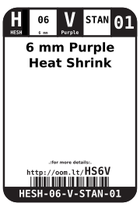
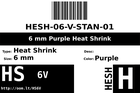
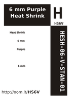

Contents
========

* [HS6V > 6 mm Purple Heat Shrink](#hs6v--6-mm-purple-heat-shrink)
	* [Images](#images)
	* [Datasheets](#datasheets)
	* [Labels](#labels)
	* [EDA](#eda)
	* [Tags](#tags)
  
![][im]
# HS6V > 6 mm Purple Heat Shrink

- ID: HESH-06-V-STAN-01
- Hex ID: HS6V
- Name: 6 mm Purple Heat Shrink
- Description: 6 mm Purple Heat Shrink

## Images
  
  

|image|image_RE|label-front|label-inventory|label-spec|
| :---: | :---: | :---: | :---: | :---: |
||||||

## Datasheets

- Datasheet: [datasheet.pdf](datasheet.pdf)

## Labels
  
  

|label-front|label-inventory|label-spec|
| :---: | :---: | :---: |
||||

## EDA

### Symbols

## Tags

- oompID: HESH-06-V-STAN-01
- name: 6 mm Purple Heat Shrink
- hexID: HS6V
- oompSort: 0606V
- oompType: HESH
- oompSize: 06
- oompColor: V
- oompDesc: STAN
- oompIndex: 01
- oompVersion: 27
- ooShrinkRatio: 2:1
- oompClass: Wiring
- oompClassCode: WIRE

[im]: image_450.jpg
