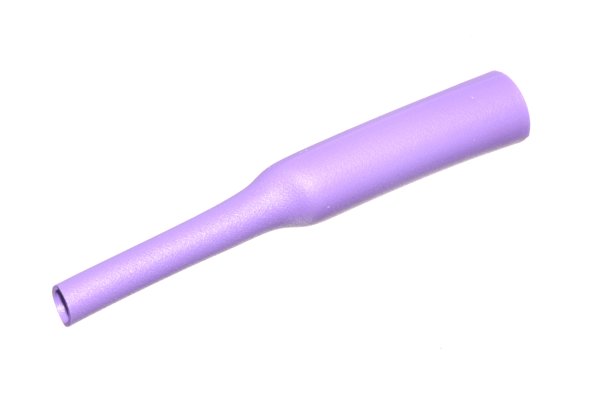
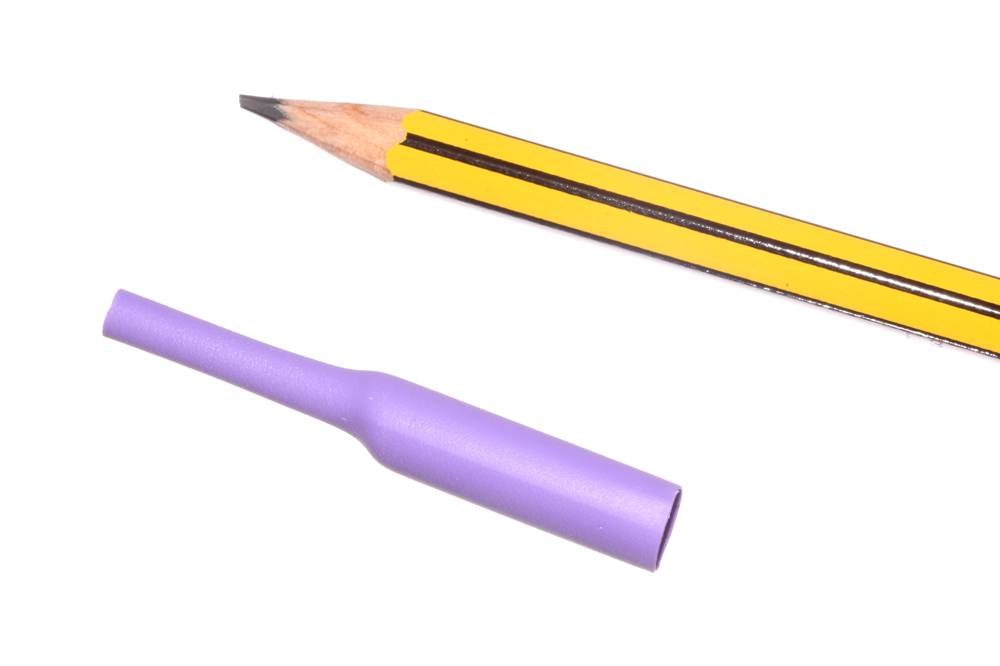

Contents
========

* [HESH-06-V-STAN-01>6 mm Purple Heat Shrink](#hesh-06-v-stan-016-mm-purple-heat-shrink)
	* [Images](#images)
	* [Datasheets](#datasheets)
	* [EDA](#eda)
		* [Footprints](#footprints)
		* [Symbols](#symbols)
	* [Tags](#tags)

# HESH-06-V-STAN-01>6 mm Purple Heat Shrink

- ID: HESH-06-V-STAN-01
- Name: HESH-06-V-STAN-01

## Images
  
  

|Main|Reference|
| :---: | :---: |
|||

## Datasheets

- Datasheet: [datasheet.pdf](datasheet.pdf)

## EDA

### Footprints
  

|||||
| :---: | :---: | :---: | :---: |

### Symbols

## Tags

- index: 275
- index: 4036
- oompID: HESH-06-V-STAN-01
- name: 6 mm Purple Heat Shrink
- hexID: HS6V
- oompSort: 0606V
- oompType: HESH
- oompSize: 06
- oompColor: V
- oompDesc: STAN
- oompIndex: 01
- oompVersion: 27
- ooShrinkRatio: 2:1
- oompClass: Wiring
- oompClassCode: WIRE
