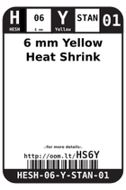
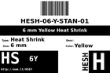
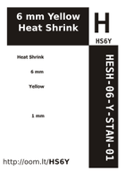

Contents
========

* [HS6Y > 6 mm Yellow Heat Shrink](#hs6y--6-mm-yellow-heat-shrink)
	* [Images](#images)
	* [Datasheets](#datasheets)
	* [Labels](#labels)
	* [EDA](#eda)
	* [Tags](#tags)
  
![][im]
# HS6Y > 6 mm Yellow Heat Shrink

- ID: HESH-06-Y-STAN-01
- Hex ID: HS6Y
- Name: 6 mm Yellow Heat Shrink
- Description: 6 mm Yellow Heat Shrink

## Images
  
  

|image|label-front|label-inventory|label-spec|
| :---: | :---: | :---: | :---: |
|||||

## Datasheets

- Datasheet: [datasheet.pdf](datasheet.pdf)

## Labels
  
  

|label-front|label-inventory|label-spec|
| :---: | :---: | :---: |
||||

## EDA

### Symbols

## Tags

- oompID: HESH-06-Y-STAN-01
- name: 6 mm Yellow Heat Shrink
- hexID: HS6Y
- oompSort: 0606Y
- oompType: HESH
- oompSize: 06
- oompColor: Y
- oompDesc: STAN
- oompIndex: 01
- oompVersion: 27
- ooShrinkRatio: 2:1
- oompClass: Wiring
- oompClassCode: WIRE

[im]: image_450.jpg
