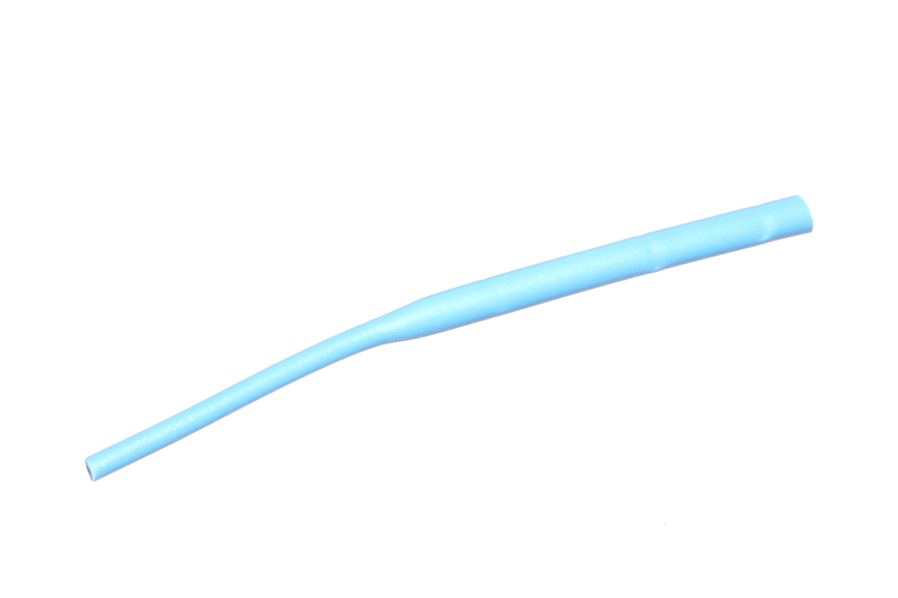

Contents
========

* [HESH-15D-L-STAN-01>1.5 mm Blue Heat Shrink](#hesh-15d-l-stan-0115-mm-blue-heat-shrink)
	* [Images](#images)
	* [Datasheets](#datasheets)
	* [EDA](#eda)
		* [Footprints](#footprints)
		* [Symbols](#symbols)
	* [Tags](#tags)
  
![][im]
# HESH-15D-L-STAN-01>1.5 mm Blue Heat Shrink

- ID: HESH-15D-L-STAN-01
- Name: HESH-15D-L-STAN-01

## Images
  
  

|Main|
| :---: |
||

## Datasheets

- Datasheet: [datasheet.pdf](datasheet.pdf)

## EDA

### Footprints
  

|||||
| :---: | :---: | :---: | :---: |

### Symbols

## Tags

- index: 281
- index: 4015
- oompID: HESH-15D-L-STAN-01
- name: 1.5 mm Blue Heat Shrink
- hexID: HS1L
- oompSort: 0101L
- oompType: HESH
- oompSize: 15D
- oompColor: L
- oompDesc: STAN
- oompIndex: 01
- oompVersion: 27
- ooShrinkRatio: 2:1
- oompClass: Wiring
- oompClassCode: WIRE

[im]: image_600.jpg
