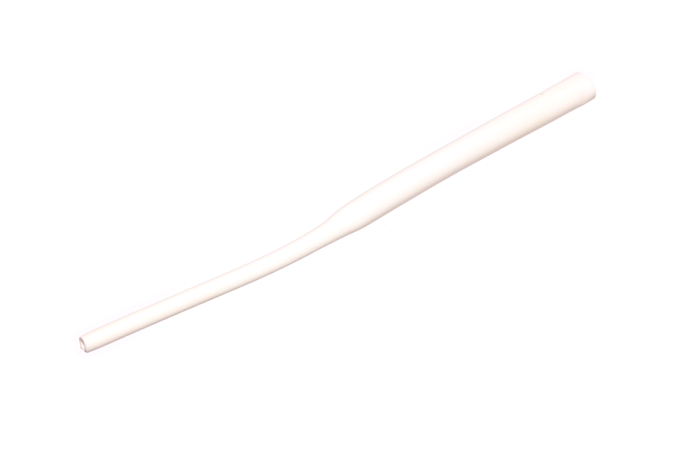
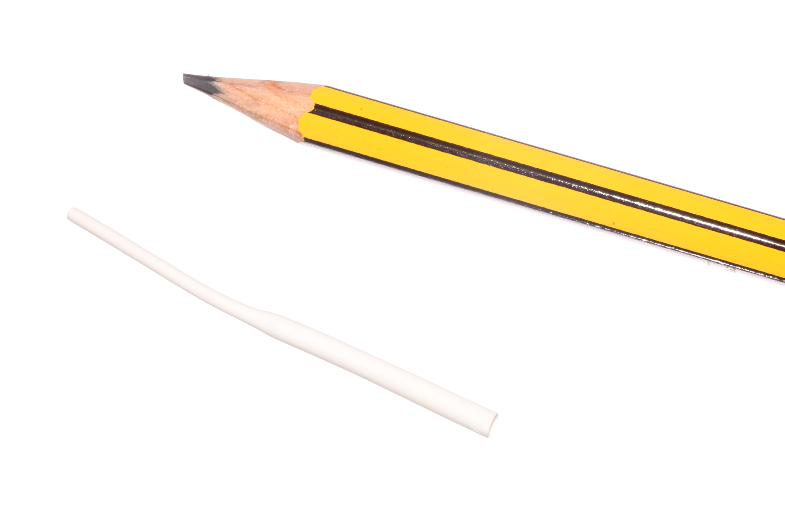

Contents
========

* [HESH-15D-W-STAN-01>1.5 mm White Heat Shrink](#hesh-15d-w-stan-0115-mm-white-heat-shrink)
	* [Images](#images)
	* [Datasheets](#datasheets)
	* [EDA](#eda)
		* [Footprints](#footprints)
		* [Symbols](#symbols)
	* [Tags](#tags)
  
![][im]
# HESH-15D-W-STAN-01>1.5 mm White Heat Shrink

- ID: HESH-15D-W-STAN-01
- Name: HESH-15D-W-STAN-01

## Images
  
  

|Main|Reference|
| :---: | :---: |
|||

## Datasheets

- Datasheet: [datasheet.pdf](datasheet.pdf)

## EDA

### Footprints
  

|||||
| :---: | :---: | :---: | :---: |

### Symbols

## Tags

- index: 286
- index: 4018
- oompID: HESH-15D-W-STAN-01
- name: 1.5 mm White Heat Shrink
- hexID: HS1W
- oompSort: 0101W
- oompType: HESH
- oompSize: 15D
- oompColor: W
- oompDesc: STAN
- oompIndex: 01
- oompVersion: 27
- ooShrinkRatio: 2:1
- oompClass: Wiring
- oompClassCode: WIRE

[im]: image_600.jpg
