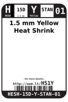
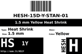
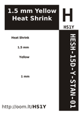

Contents
========

* [HS1Y > 1.5 mm Yellow Heat Shrink](#hs1y--15-mm-yellow-heat-shrink)
	* [Datasheets](#datasheets)
	* [Labels](#labels)
	* [EDA](#eda)
	* [Images](#images)
	* [Tags](#tags)
  
![][im]
# HS1Y > 1.5 mm Yellow Heat Shrink

- ID: HESH-15D-Y-STAN-01
- Hex ID: HS1Y
- Name: 1.5 mm Yellow Heat Shrink
- Description: 1.5 mm Yellow Heat Shrink
- Long Link: [http://oom.lt/HESH-15D-Y-STAN-01](http://oom.lt/HESH-15D-Y-STAN-01)
- Short Link: [http://oom.lt/HS1Y](http://oom.lt/HS1Y)

## Datasheets

- Datasheet: [datasheet.pdf](datasheet.pdf)

## Labels
  
  

|label-front|label-inventory|label-spec|
| :---: | :---: | :---: |
||||

## EDA

### Symbols

## Images
  
  

|image|image_RE|label-front|label-inventory|label-spec|
| :---: | :---: | :---: | :---: | :---: |
||||||

## Tags

- oompID: HESH-15D-Y-STAN-01
- name: 1.5 mm Yellow Heat Shrink
- hexID: HS1Y
- oompSort: 0101Y
- oompType: HESH
- oompSize: 15D
- oompColor: Y
- oompDesc: STAN
- oompIndex: 01
- oompVersion: 27
- ooShrinkRatio: 2:1
- oompClass: Wiring
- oompClassCode: WIRE

[im]: image_450.jpg
