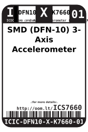
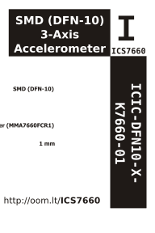

Contents
========

* [ICIC-DFN10-X-K7660-01>SMD (DFN-10) 3-Axis Accelerometer (MMA7660FCR1)](#icic-dfn10-x-k7660-01smd-dfn-10-3-axis-accelerometer-mma7660fcr1)
	* [Datasheets](#datasheets)
	* [Labels](#labels)
	* [EDA](#eda)
		* [Symbols](#symbols)
	* [Tags](#tags)

# ICIC-DFN10-X-K7660-01>SMD (DFN-10) 3-Axis Accelerometer (MMA7660FCR1)

- ID: ICIC-DFN10-X-K7660-01
- Name: ICIC-DFN10-X-K7660-01

## Datasheets

- Datasheet: [datasheet.pdf](datasheet.pdf)

## Labels
  
  

|label-front|label-inventory|label-spec|
| :---: | :---: | :---: |
||||

## EDA

### Symbols

## Tags

- oompID: ICIC-DFN10-X-K7660-01
- name: SMD (DFN-10) 3-Axis Accelerometer (MMA7660FCR1)
- hexID: ICS7660
- oompSort: ICICDFN10K7660
- oompType: ICIC
- oompSize: DFN10
- oompColor: X
- oompDesc: K7660
- oompIndex: 01
- oompVersion: 98
- ooNumPins: 10
- ooDesignator: U1
