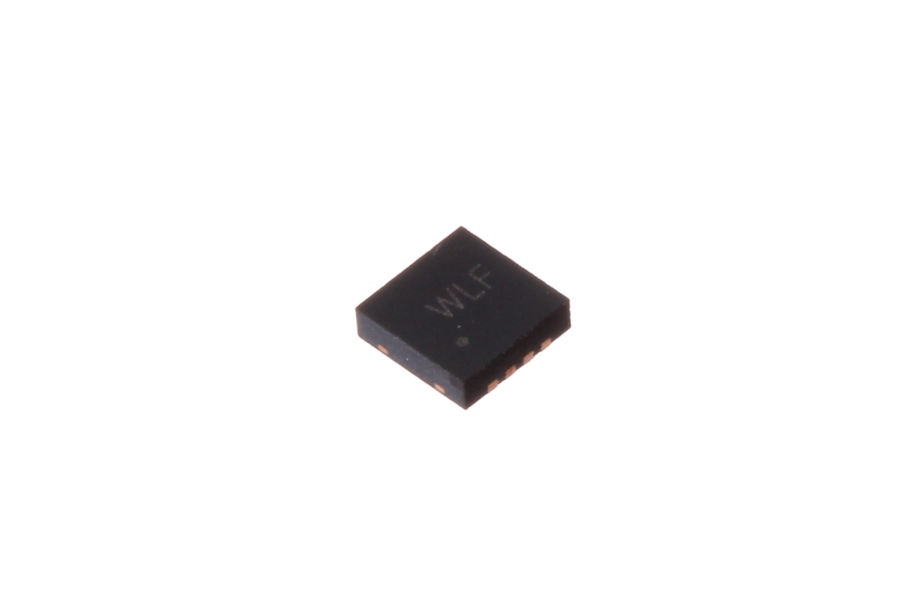
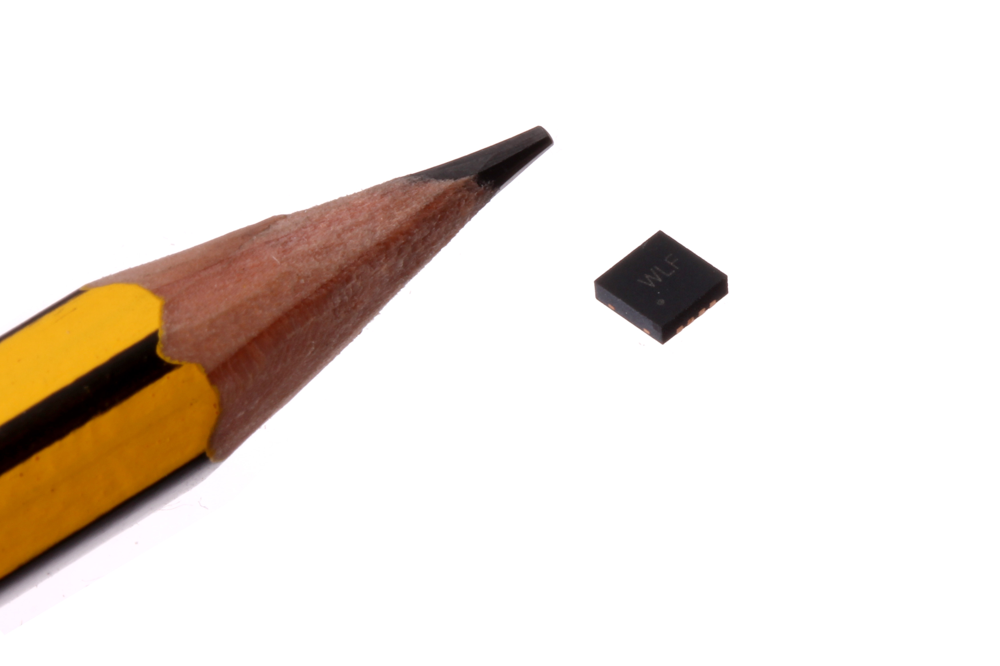
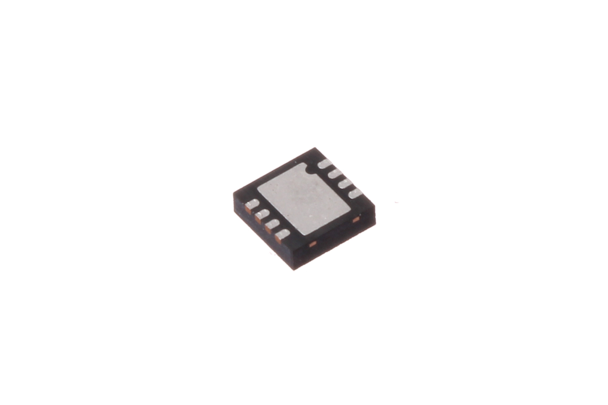

Contents
========

* [ICIC-DFN8-X-KCN3065-01>SMD (DFN-8) Lithium Ion Battery Charger (CN3065)](#icic-dfn8-x-kcn3065-01smd-dfn-8-lithium-ion-battery-charger-cn3065)
	* [Images](#images)
	* [Datasheets](#datasheets)
	* [EDA](#eda)
		* [Footprints](#footprints)
		* [Symbols](#symbols)
	* [Tags](#tags)

# ICIC-DFN8-X-KCN3065-01>SMD (DFN-8) Lithium Ion Battery Charger (CN3065)

- ID: ICIC-DFN8-X-KCN3065-01
- Name: ICIC-DFN8-X-KCN3065-01

## Images
  
  

|Main|Reference|Bottom|
| :---: | :---: | :---: |
||||

## Datasheets

- Datasheet: [datasheet.pdf](datasheet.pdf)

## EDA

### Footprints
  

|||||
| :---: | :---: | :---: | :---: |

### Symbols

## Tags

- index: 289
- oompID: ICIC-DFN8-X-KCN3065-01
- name: SMD (DFN-8) Lithium Ion Battery Charger (CN3065)
- hexID: ICS3065
- oompSort: 
- oompClass: Surface Mount
- oompClassCode: SMDS
- oompType: ICIC
- oompSize: DFN8
- oompColor: X
- oompDesc: KCN3065
- oompIndex: 01
- oompVersion: 40
- ooDesignator: U1
