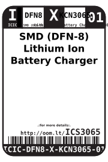
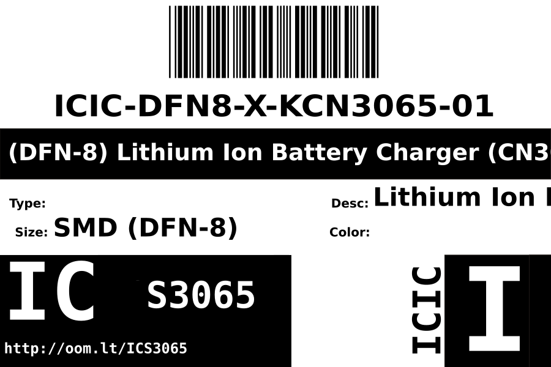

Contents
========

* [ICIC-DFN8-X-KCN3065-01>SMD (DFN-8) Lithium Ion Battery Charger (CN3065)](#icic-dfn8-x-kcn3065-01smd-dfn-8-lithium-ion-battery-charger-cn3065)
	* [Images](#images)
	* [Datasheets](#datasheets)
	* [Labels](#labels)
	* [EDA](#eda)
		* [Symbols](#symbols)
	* [Tags](#tags)
  
![][im]
# ICIC-DFN8-X-KCN3065-01>SMD (DFN-8) Lithium Ion Battery Charger (CN3065)

- ID: ICIC-DFN8-X-KCN3065-01
- Name: ICIC-DFN8-X-KCN3065-01

## Images
  
  

|image|image_RE|image_BOTTOM|
| :---: | :---: | :---: |
||||

## Datasheets

- Datasheet: [datasheet.pdf](datasheet.pdf)

## Labels
  
  

|label-front|label-inventory|label-spec|
| :---: | :---: | :---: |
||||

## EDA

### Symbols

## Tags

- oompID: ICIC-DFN8-X-KCN3065-01
- name: SMD (DFN-8) Lithium Ion Battery Charger (CN3065)
- hexID: ICS3065
- oompSort: 
- oompClass: Surface Mount
- oompClassCode: SMDS
- oompType: ICIC
- oompSize: DFN8
- oompColor: X
- oompDesc: KCN3065
- oompIndex: 01
- oompVersion: 40
- ooDesignator: U1

[im]: image_600.jpg
