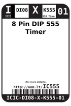
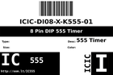

Contents
========

* [IC555 > 8 Pin DIP 555 Timer](#ic555--8-pin-dip-555-timer)
	* [Images](#images)
	* [Labels](#labels)
	* [EDA](#eda)
	* [Tags](#tags)

# IC555 > 8 Pin DIP 555 Timer

- ID: ICIC-DI08-X-K555-01
- Hex ID: IC555
- Name: 8 Pin DIP 555 Timer
- Description: 8 Pin DIP 555 Timer

## Images
  
  

|label-front|label-inventory|label-spec|
| :---: | :---: | :---: |
||||

## Labels
  
  

|label-front|label-inventory|label-spec|
| :---: | :---: | :---: |
||||

## EDA

### Symbols

## Tags

- oompID: ICIC-DI08-X-K555-01
- name: 8 Pin DIP 555 Timer
- hexID: IC555
- oompSort: ICICDI08K555
- oompType: ICIC
- oompSize: DI08
- oompColor: X
- oompDesc: K555
- oompIndex: 01
- oompVersion: 98
- ooNumPins: 8
- ooFootprint: OOMP-ICIC-DI08-X-XXXX-01
- ooPin1: GND
- ooPin2: TRIGGER
- ooPin3: OUTPUT
- ooPin4: RESET
- ooPin5: CONTROL-VOLTAGE
- ooPin6: THRESHOLD
- ooPin7: DISCHARGE
- ooPin8: Vcc
- oompDiag: template;ICIC-DI08-X-XXXX-01-diag
- ooPackageMarking: ISDP1820P
- ooDesignator: U
