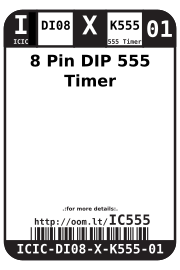
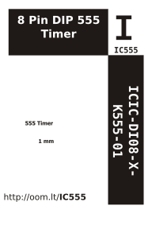

Contents
========

* [ICIC-DI08-X-K555-01>8 Pin DIP 555 Timer](#icic-di08-x-k555-018-pin-dip-555-timer)
	* [Datasheets](#datasheets)
	* [Labels](#labels)
	* [EDA](#eda)
		* [Symbols](#symbols)
	* [Tags](#tags)

# ICIC-DI08-X-K555-01>8 Pin DIP 555 Timer

- ID: ICIC-DI08-X-K555-01
- Name: ICIC-DI08-X-K555-01

## Datasheets

- Datasheet: [datasheet.pdf](datasheet.pdf)

## Labels
  
  

|Front|Inventory|Specifications|
| :---: | :---: | :---: |
||||

## EDA

### Symbols

## Tags

- index: 12589
- oompID: ICIC-DI08-X-K555-01
- name: 8 Pin DIP 555 Timer
- hexID: IC555
- oompSort: ICICDI08K555
- oompType: ICIC
- oompSize: DI08
- oompColor: X
- oompDesc: K555
- oompIndex: 01
- oompVersion: 98
- ooNumPins: 8
- ooFootprint: OOMP-ICIC-DI08-X-XXXX-01
- ooPin1: GND
- ooPin2: TRIGGER
- ooPin3: OUTPUT
- ooPin4: RESET
- ooPin5: CONTROL-VOLTAGE
- ooPin6: THRESHOLD
- ooPin7: DISCHARGE
- ooPin8: Vcc
- oompDiag: template;ICIC-DI08-X-XXXX-01-diag
- ooPackageMarking: ISDP1820P
- ooDesignator: U
