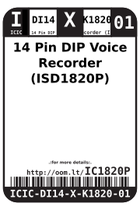

Contents
========

* [IC1820P > 14 Pin DIP Voice Recorder (ISD1820P)](#ic1820p--14-pin-dip-voice-recorder-isd1820p)
	* [Datasheets](#datasheets)
	* [Labels](#labels)
	* [EDA](#eda)
	* [Images](#images)
	* [Tags](#tags)

# IC1820P > 14 Pin DIP Voice Recorder (ISD1820P)

- ID: ICIC-DI14-X-K1820-01
- Hex ID: IC1820P
- Name: 14 Pin DIP Voice Recorder (ISD1820P)
- Description: 14 Pin DIP Voice Recorder (ISD1820P)
- Long Link: [http://oom.lt/ICIC-DI14-X-K1820-01](http://oom.lt/ICIC-DI14-X-K1820-01)
- Long Link: [http://oom.lt/IC1820P](http://oom.lt/IC1820P)

## Datasheets

- Datasheet: [datasheet.pdf](datasheet.pdf)

## Labels
  
  

|label-front|label-inventory|label-spec|
| :---: | :---: | :---: |
||||

## EDA

### Symbols

## Images
  
  

|label-front|label-inventory|label-spec|
| :---: | :---: | :---: |
||||

## Tags

- oompID: ICIC-DI14-X-K1820-01
- name: 14 Pin DIP Voice Recorder (ISD1820P)
- hexID: IC1820P
- oompSort: ICICDI14K1820
- oompType: ICIC
- oompSize: DI14
- oompColor: X
- oompDesc: K1820
- oompIndex: 01
- oompVersion: 98
- ooNumPins: 14
- ooFootprint: OOMP-ICIC-DI14-X-XXXX-01
- ooPackageMarking: ISDP1820P
- ooDesignator: U
