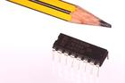
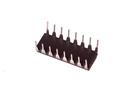
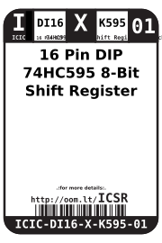
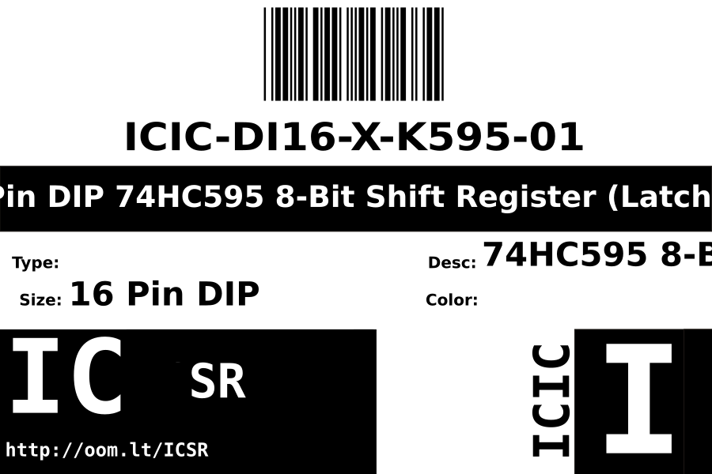
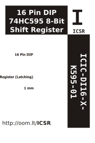

Contents
========

* [ICIC-DI16-X-K595-01>16 Pin DIP 74HC595 8-Bit Shift Register (Latching)](#icic-di16-x-k595-0116-pin-dip-74hc595-8-bit-shift-register-latching)
	* [Images](#images)
	* [Datasheets](#datasheets)
	* [Labels](#labels)
	* [EDA](#eda)
		* [Symbols](#symbols)
	* [Tags](#tags)
  
![][im]
# ICIC-DI16-X-K595-01>16 Pin DIP 74HC595 8-Bit Shift Register (Latching)

- ID: ICIC-DI16-X-K595-01
- Name: ICIC-DI16-X-K595-01

## Images
  
  

|image|image_RE|image_BOTTOM|
| :---: | :---: | :---: |
||||

## Datasheets

- Datasheet: [datasheet.pdf](datasheet.pdf)

## Labels
  
  

|label-front|label-inventory|label-spec|
| :---: | :---: | :---: |
||||

## EDA

### Symbols

## Tags

- oompID: ICIC-DI16-X-K595-01
- name: 16 Pin DIP 74HC595 8-Bit Shift Register (Latching)
- hexID: ICSR
- oompSort: 74HC595
- oompType: ICIC
- oompSize: DI16
- oompColor: X
- oompDesc: K595
- oompIndex: 01
- oompVersion: 99
- ooNumPins: 16
- ooFootprint: OOMP-ICIC-DI16-X-XXXX-01
- oompClass: Through Hole Component
- oompClassCode: THTH
- ooDesignator: U1

[im]: image_600.jpg
