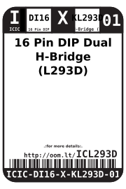
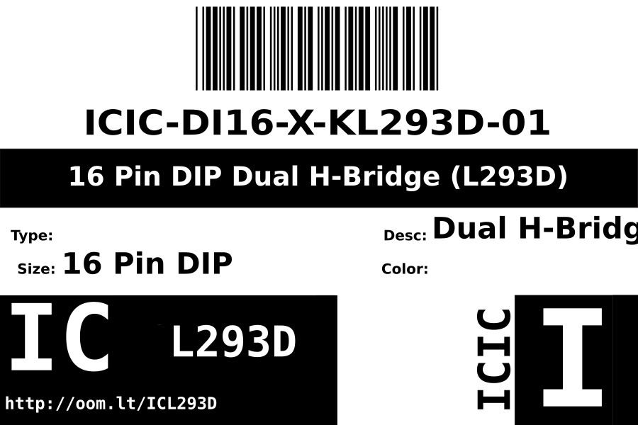
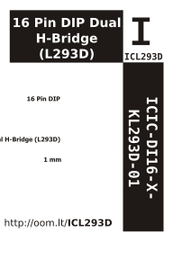

Contents
========

* [ICIC-DI16-X-KL293D-01>16 Pin DIP Dual H-Bridge (L293D)](#icic-di16-x-kl293d-0116-pin-dip-dual-h-bridge-l293d)
	* [Datasheets](#datasheets)
	* [Labels](#labels)
	* [EDA](#eda)
		* [Symbols](#symbols)
	* [Tags](#tags)

# ICIC-DI16-X-KL293D-01>16 Pin DIP Dual H-Bridge (L293D)

- ID: ICIC-DI16-X-KL293D-01
- Name: ICIC-DI16-X-KL293D-01

## Datasheets

- Datasheet: [datasheet.pdf](datasheet.pdf)

## Labels
  
  

|Front|Inventory|Specifications|
| :---: | :---: | :---: |
||||

## EDA

### Symbols

## Tags

- oompID: ICIC-DI16-X-KL293D-01
- name: 16 Pin DIP Dual H-Bridge (L293D)
- oompSort: 
- oompType: ICIC
- oompSize: DI16
- oompColor: X
- oompDesc: KL293D
- oompIndex: 01
- oompVersion: 999
- hexID: ICL293D
- ooPitch: 2.54 mm
- ooPitchWidth: 0.3"
- numRows: 2
- ooNumPins: 16
- ooPin1: EN1,2
- ooPin1x: 0
- ooPin1y: 0
- ooPin2: 1IN
- ooPin2x: 0
- ooPin2y: 0.1
- ooPin3: 1OUT
- ooPin3x: 0
- ooPin3y: 0.2
- ooPin4: GND
- ooPin4x: 0
- ooPin4y: 0.3
- ooPin5: GND
- ooPin5x: 0
- ooPin5y: 0.4
- ooPin6: 2OUT
- ooPin6x: 0
- ooPin6y: 0.5
- ooPin7: 2IN
- ooPin7x: 0
- ooPin7y: 0.6
- ooPin8: VCC
- ooPin8x: 0
- ooPin8y: 0.7
- ooPin9: EN3,4
- ooPin9x: 0.3"
- ooPin9y: 0.7"
- ooPin10: 3IN
- ooPin10x: 0.3"
- ooPin10y: 0.6"
- ooPin11: 3OUT
- ooPin11x: 0.3"
- ooPin11y: 0.5"
- ooPin12: GND
- ooPin12x: 0.3"
- ooPin12y: 0.4"
- ooPin13: GND
- ooPin13x: 0.3"
- ooPin13y: 0.3"
- ooPin14: 4OUT
- ooPin14x: 0.3"
- ooPin14y: 0.2"
- ooPin15: 4IN
- ooPin15x: 0.3"
- ooPin15y: 0.1"
- ooPin16: VMOT
- ooPin16x: 0.3"
- ooPin16y: 0
- oompDiag: template;ICIC-DI16-X-XXXX-01
- oompSymbol: twoSidedPackage;##ooNumPins@@
- oompFootprint: twoSidedPackage;##ooNumPins@@;##ooPitchWidth@@;##ooPitch@@
