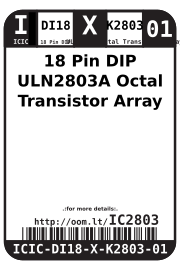

Contents
========

* [ICIC-DI18-X-K2803-01>18 Pin DIP ULN2803A Octal Transistor Array](#icic-di18-x-k2803-0118-pin-dip-uln2803a-octal-transistor-array)
	* [Images](#images)
	* [Datasheets](#datasheets)
	* [Labels](#labels)
	* [EDA](#eda)
		* [Symbols](#symbols)
	* [Tags](#tags)
  
![][im]
# ICIC-DI18-X-K2803-01>18 Pin DIP ULN2803A Octal Transistor Array

- ID: ICIC-DI18-X-K2803-01
- Name: ICIC-DI18-X-K2803-01

## Images
  
  

|Main|Bottom|
| :---: | :---: |
|||

## Datasheets

- Datasheet: [datasheet.pdf](datasheet.pdf)

## Labels
  
  

|Front|Inventory|Specifications|
| :---: | :---: | :---: |
||||

## EDA

### Symbols

## Tags

- index: 294
- index: 9876
- oompID: ICIC-DI18-X-K2803-01
- name: 18 Pin DIP ULN2803A Octal Transistor Array
- hexID: IC2803
- oompSort: ULN2803A
- oompType: ICIC
- oompSize: DI18
- oompColor: X
- oompDesc: K2803
- oompIndex: 01
- oompVersion: 99
- ooNumPins: 18
- ooFootprint: OOMP-ICIC-DI18-X-XXXX-01
- oompClass: Through Hole Component
- oompClassCode: THTH
- ooDesignator: U1
- ooPin1: IN1
- ooPin2: IN2
- ooPin3: IN3
- ooPin4: IN4
- ooPin5: IN5
- ooPin6: IN6
- ooPin7: IN7
- ooPin8: IN8
- ooPin9: GND
- ooPin10: COM
- ooPin11: OUT8
- ooPin12: OUT7
- ooPin13: OUT6
- ooPin14: OUT5
- ooPin15: OUT4
- ooPin16: OUT3
- ooPin17: OUT2
- ooPin18: OUT1

[im]: image_600.jpg
