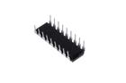

Contents
========

* [ICIC-DI18-X-KTM1636-01>18 Pin DIP 7 Segment Driver and Keypad Scanning (TM1636)](#icic-di18-x-ktm1636-0118-pin-dip-7-segment-driver-and-keypad-scanning-tm1636)
	* [Images](#images)
	* [Datasheets](#datasheets)
	* [Labels](#labels)
	* [EDA](#eda)
		* [Symbols](#symbols)
	* [Tags](#tags)
  
![][im]
# ICIC-DI18-X-KTM1636-01>18 Pin DIP 7 Segment Driver and Keypad Scanning (TM1636)

- ID: ICIC-DI18-X-KTM1636-01
- Name: ICIC-DI18-X-KTM1636-01

## Images
  
  

|image|image_RE|image_BOTTOM|
| :---: | :---: | :---: |
||||

## Datasheets

- Datasheet: [datasheet.pdf](datasheet.pdf)

## Labels
  
  

|label-front|label-inventory|label-spec|
| :---: | :---: | :---: |
||||

## EDA

### Symbols

## Tags

- oompID: ICIC-DI18-X-KTM1636-01
- name: 18 Pin DIP 7 Segment Driver and Keypad Scanning (TM1636)
- hexID: IC1636
- oompSort: 
- oompClass: Through Hole
- oompClassCode: THTH
- oompType: ICIC
- oompSize: DI18
- oompColor: X
- oompDesc: KTM1636
- oompIndex: 01
- oompVersion: 40
- ooNumPins: 18
- ooFootprint: OOMP-ICIC-DI18-X-XXXX-01
- ooDesignator: U1

[im]: image_600.jpg
