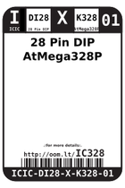
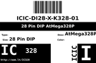
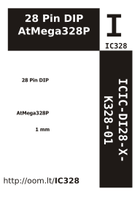
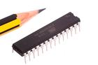

Contents
========

* [IC328 > 28 Pin DIP AtMega328P](#ic328--28-pin-dip-atmega328p)
	* [Datasheets](#datasheets)
	* [Labels](#labels)
	* [EDA](#eda)
	* [Images](#images)
	* [Tags](#tags)
  
![][im]
# IC328 > 28 Pin DIP AtMega328P

- ID: ICIC-DI28-X-K328-01
- Hex ID: IC328
- Name: 28 Pin DIP AtMega328P
- Description: 28 Pin DIP AtMega328P
- Long Link: [http://oom.lt/ICIC-DI28-X-K328-01](http://oom.lt/ICIC-DI28-X-K328-01)
- Long Link: [http://oom.lt/IC328](http://oom.lt/IC328)

## Datasheets

- Datasheet: [datasheet.pdf](datasheet.pdf)

## Labels
  
  

|label-front|label-inventory|label-spec|
| :---: | :---: | :---: |
||||

## EDA

### Symbols

## Images
  
  

|image|image_RE|label-front|label-inventory|label-spec|
| :---: | :---: | :---: | :---: | :---: |
||||||

## Tags

- oompID: ICIC-DI28-X-K328-01
- name: 28 Pin DIP AtMega328P
- hexID: IC328
- oompSort: ATMega 328
- oompType: ICIC
- oompSize: DI28
- oompColor: X
- oompDesc: K328
- oompIndex: 01
- oompVersion: 99
- ooPitch: 2.54 mm
- ooWidth: 34.7 mm
- ooHeight: 4.5 mm
- ooLength: 7.25 mm
- ooManufacturer: C-ATME
- ooManufacturerPartNumber: ATMEGA328P-PU
- ooNumPins: 28
- ooNumPins: 28
- ooFootprint: OOMP-ICIC-DI28-X-XXXX-01
- useID: 1
- importance: 1
- useTitle: Arduino
- useDescription: Used as the Microcontroller in the Arduino UNO
- ooSEEEDsku: 1030050P1
- ooSEEEDdesc: IC MCU 8BIT 32KB FLASH
- ooSEEED3dModel: http://www.seeedstudio.com/wiki/File:DIP28.zip
- oompClass: Through Hole Component
- oompClassCode: THTH
- ooPin1: PC6
- ooPin2: PD0
- ooPin3: PD1
- ooPin4: PD2
- ooPin5: PD3
- ooPin6: PD4
- ooPin7: VCC
- ooPin8: GND
- ooPin9: PB6
- ooPin10: PB7
- ooPin11: PD5
- ooPin12: PD6
- ooPin13: PD7
- ooPin14: PB0
- ooPin15: PB1
- ooPin16: PB2
- ooPin17: PB3
- ooPin18: PB4
- ooPin19: PB5
- ooPin20: AVCC
- ooPin21: AREF
- ooPin22: GND
- ooPin23: PC0
- ooPin24: PC1
- ooPin25: PC2
- ooPin26: PC3
- ooPin27: PC4
- ooPin28: PC5
- oompDiag: template;ICIC-DI28-X-XXXX-01-diag
- ooPackageMarking: ATMEGA328
- ooDesignator: U1

[im]: image_450.jpg
