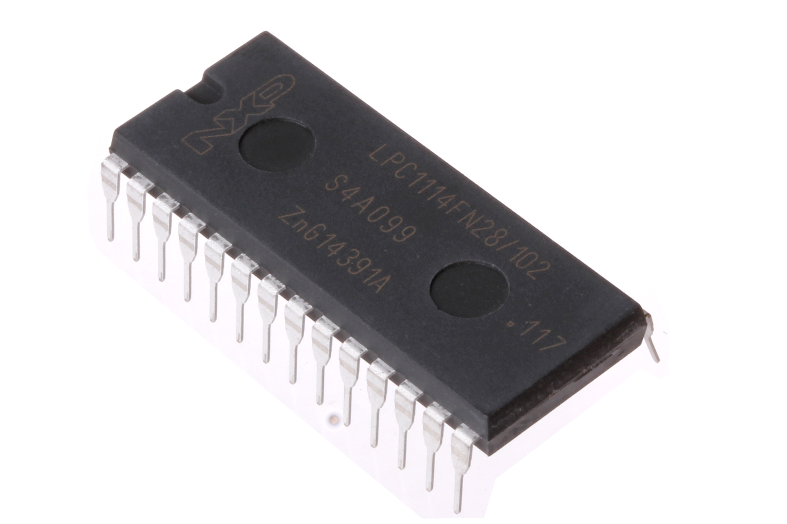
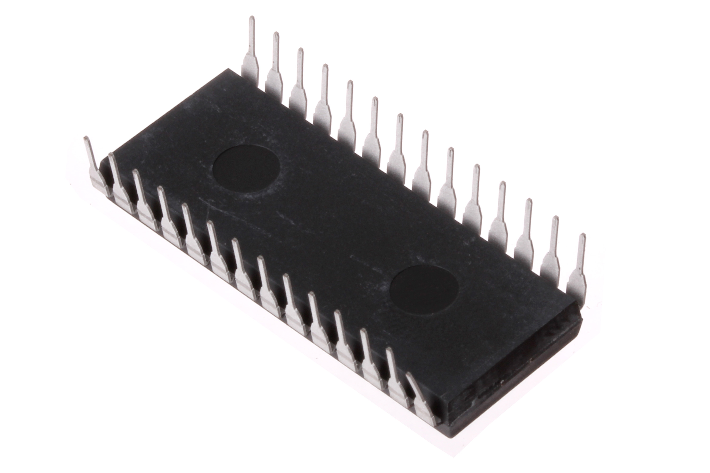

Contents
========

* [ICIC-DI28W-X-KLPC14-01>28 Pin DIP (0.6") DIP LPC1114 (Cortex M0)](#icic-di28w-x-klpc14-0128-pin-dip-06-dip-lpc1114-cortex-m0)
	* [Images](#images)
	* [Datasheets](#datasheets)
	* [EDA](#eda)
		* [Symbols](#symbols)
	* [Tags](#tags)
  
![][im]
# ICIC-DI28W-X-KLPC14-01>28 Pin DIP (0.6") DIP LPC1114 (Cortex M0)

- ID: ICIC-DI28W-X-KLPC14-01
- Name: ICIC-DI28W-X-KLPC14-01

## Images
  
  

|Main|Bottom|
| :---: | :---: |
|||

## Datasheets

- Datasheet: [datasheet.pdf](datasheet.pdf)

## EDA

### Symbols

## Tags

- index: 297
- oompID: ICIC-DI28W-X-KLPC14-01
- name: 28 Pin DIP (0.6") DIP LPC1114 (Cortex M0)
- hexID: ICLPC14
- oompSort: 
- oompClass: Through Hole
- oompClassCode: THTH
- oompType: ICIC
- oompSize: DI28W
- oompColor: X
- oompDesc: KLPC14
- oompIndex: 01
- oompVersion: 40
- ooNumPins: 28
- ooFootprint: OOMP-ICIC-DI28W-X-XXXX-01
- ooDesignator: U1

[im]: image_600.jpg
