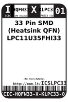
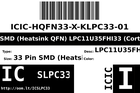
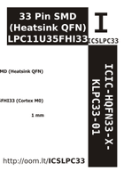

Contents
========

* [ICSLPC33 > 33 Pin SMD (Heatsink QFN) LPC11U35FHI33 (Cortex M0)](#icslpc33--33-pin-smd-heatsink-qfn-lpc11u35fhi33-cortex-m0)
	* [Datasheets](#datasheets)
	* [Labels](#labels)
	* [EDA](#eda)
	* [Images](#images)
	* [Tags](#tags)

# ICSLPC33 > 33 Pin SMD (Heatsink QFN) LPC11U35FHI33 (Cortex M0)

- ID: ICIC-HQFN33-X-KLPC33-01
- Hex ID: ICSLPC33
- Name: 33 Pin SMD (Heatsink QFN) LPC11U35FHI33 (Cortex M0)
- Description: 33 Pin SMD (Heatsink QFN) LPC11U35FHI33 (Cortex M0)
- Long Link: [http://oom.lt/ICIC-HQFN33-X-KLPC33-01](http://oom.lt/ICIC-HQFN33-X-KLPC33-01)
- Short Link: [http://oom.lt/ICSLPC33](http://oom.lt/ICSLPC33)

## Datasheets

- Datasheet: [datasheet.pdf](datasheet.pdf)

## Labels
  
  

|label-front|label-inventory|label-spec|
| :---: | :---: | :---: |
||||

## EDA

## Images
  
  

|label-front|label-inventory|label-spec|
| :---: | :---: | :---: |
||||

## Tags

- oompID: ICIC-HQFN33-X-KLPC33-01
- name: 33 Pin SMD (Heatsink QFN) LPC11U35FHI33 (Cortex M0)
- hexID: ICSLPC33
- oompSort: 
- oompClass: Surface Mount
- oompClassCode: SMDS
- oompType: ICIC
- oompSize: HQFN33
- oompColor: X
- oompDesc: KLPC33
- oompIndex: 01
- oompVersion: 40
- ooDesignator: U1
