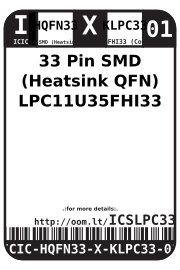
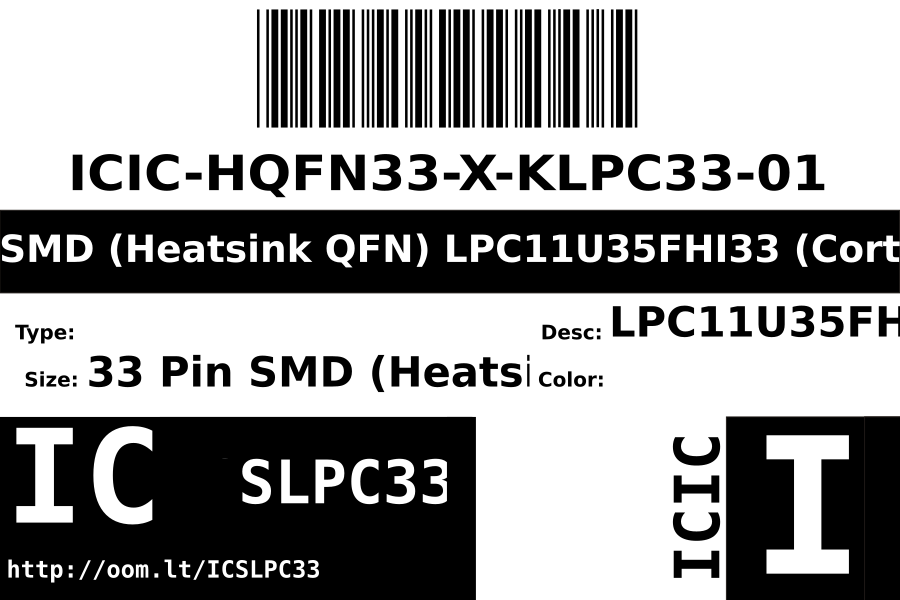

Contents
========

* [ICIC-HQFN33-X-KLPC33-01>33 Pin SMD (Heatsink QFN) LPC11U35FHI33 (Cortex M0)](#icic-hqfn33-x-klpc33-0133-pin-smd-heatsink-qfn-lpc11u35fhi33-cortex-m0)
	* [Datasheets](#datasheets)
	* [Labels](#labels)
	* [EDA](#eda)
		* [Symbols](#symbols)
	* [Tags](#tags)

# ICIC-HQFN33-X-KLPC33-01>33 Pin SMD (Heatsink QFN) LPC11U35FHI33 (Cortex M0)

- ID: ICIC-HQFN33-X-KLPC33-01
- Name: ICIC-HQFN33-X-KLPC33-01

## Datasheets

- Datasheet: [datasheet.pdf](datasheet.pdf)

## Labels
  
  

|Front|Inventory|Specifications|
| :---: | :---: | :---: |
||||

## EDA

### Symbols

## Tags

- index: 12597
- oompID: ICIC-HQFN33-X-KLPC33-01
- name: 33 Pin SMD (Heatsink QFN) LPC11U35FHI33 (Cortex M0)
- hexID: ICSLPC33
- oompSort: 
- oompClass: Surface Mount
- oompClassCode: SMDS
- oompType: ICIC
- oompSize: HQFN33
- oompColor: X
- oompDesc: KLPC33
- oompIndex: 01
- oompVersion: 40
- ooDesignator: U1
