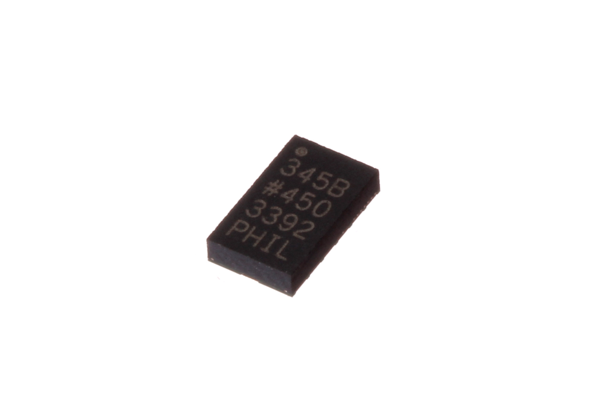
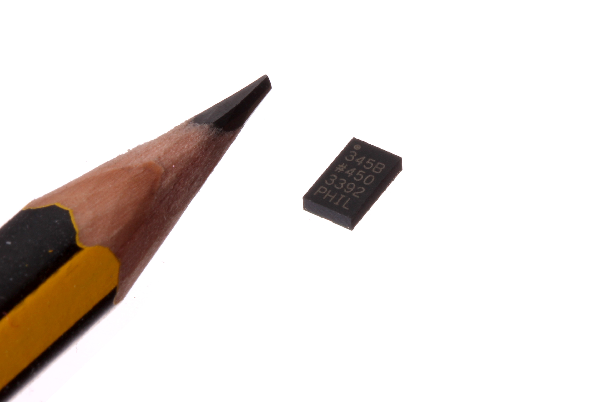
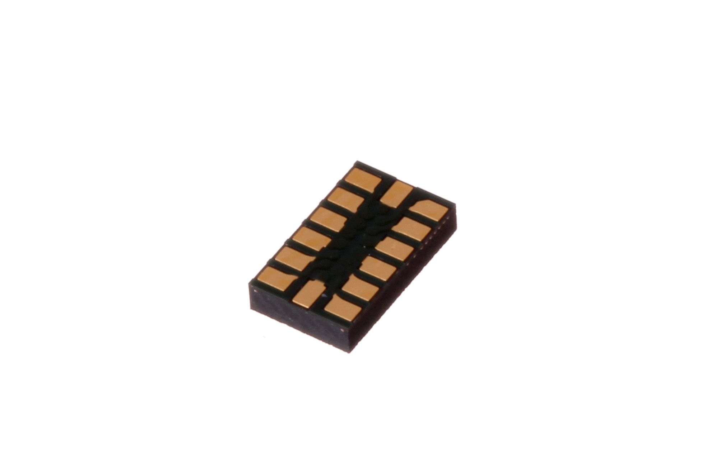
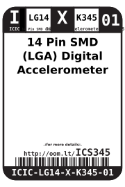

Contents
========

* [ICIC-LG14-X-K345-01>14 Pin SMD (LGA) Digital Accelerometer (ADXL345)](#icic-lg14-x-k345-0114-pin-smd-lga-digital-accelerometer-adxl345)
	* [Images](#images)
	* [Datasheets](#datasheets)
	* [Labels](#labels)
	* [EDA](#eda)
		* [Symbols](#symbols)
	* [Tags](#tags)
  
![][im]
# ICIC-LG14-X-K345-01>14 Pin SMD (LGA) Digital Accelerometer (ADXL345)

- ID: ICIC-LG14-X-K345-01
- Name: ICIC-LG14-X-K345-01

## Images
  
  

|Main|Reference|Bottom|
| :---: | :---: | :---: |
||||

## Datasheets

- Datasheet: [datasheet.pdf](datasheet.pdf)

## Labels
  
  

|Front|Inventory|Specifications|
| :---: | :---: | :---: |
||||

## EDA

### Symbols

## Tags

- hexID: ICS345
- oompSort: 
- oompClass: Surface Mount
- oompClassCode: SMDS
- oompType: ICIC
- oompSize: LG14
- oompColor: X
- oompDesc: K345
- oompIndex: 01
- oompVersion: 40
- ooDesignator: U1

[im]: image_600.jpg
