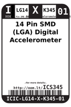
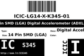
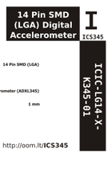

Contents
========

* [ICS345 > 14 Pin SMD (LGA) Digital Accelerometer (ADXL345)](#ics345--14-pin-smd-lga-digital-accelerometer-adxl345)
	* [Images](#images)
	* [Datasheets](#datasheets)
	* [Labels](#labels)
	* [EDA](#eda)
	* [Tags](#tags)
  
![][im]
# ICS345 > 14 Pin SMD (LGA) Digital Accelerometer (ADXL345)

- ID: ICIC-LG14-X-K345-01
- Hex ID: ICS345
- Name: 14 Pin SMD (LGA) Digital Accelerometer (ADXL345)
- Description: 14 Pin SMD (LGA) Digital Accelerometer (ADXL345)

## Images
  
  

|image|image_RE|image_BOTTOM|label-front|label-inventory|label-spec|
| :---: | :---: | :---: | :---: | :---: | :---: |
|||||||

## Datasheets

- Datasheet: [datasheet.pdf](datasheet.pdf)

## Labels
  
  

|label-front|label-inventory|label-spec|
| :---: | :---: | :---: |
||||

## EDA

### Symbols

## Tags

- oompID: ICIC-LG14-X-K345-01
- name: 14 Pin SMD (LGA) Digital Accelerometer (ADXL345)
- hexID: ICS345
- oompSort: 
- oompClass: Surface Mount
- oompClassCode: SMDS
- oompType: ICIC
- oompSize: LG14
- oompColor: X
- oompDesc: K345
- oompIndex: 01
- oompVersion: 40
- ooDesignator: U1

[im]: image_450.jpg
