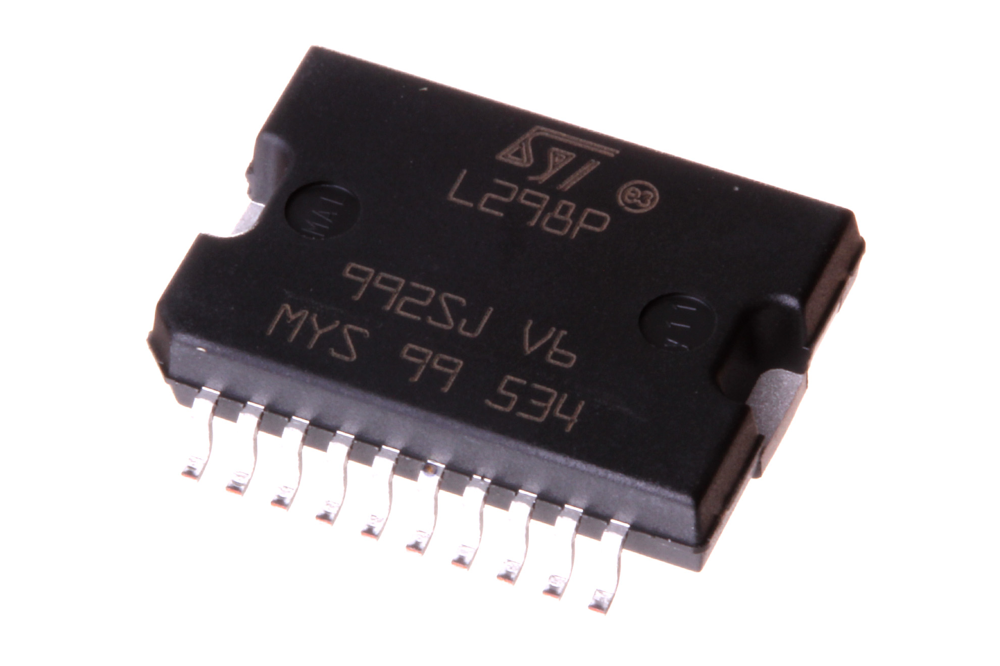
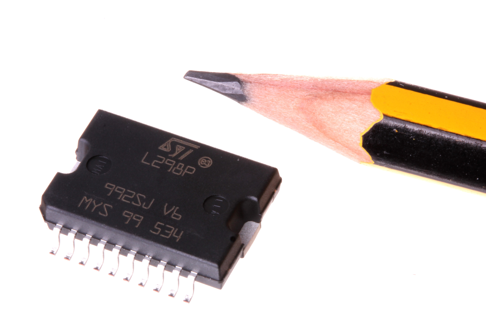
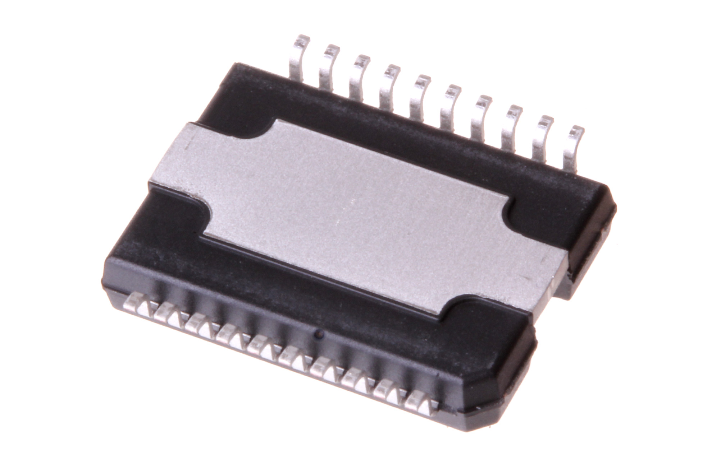

Contents
========

* [ICIC-PS20-X-KL298-A4>SMD (Power SO-20) Dual H-Bridge (L298) 4 A](#icic-ps20-x-kl298-a4smd-power-so-20-dual-h-bridge-l298-4-a)
	* [Images](#images)
	* [Datasheets](#datasheets)
	* [Labels](#labels)
	* [EDA](#eda)
		* [Symbols](#symbols)
	* [Tags](#tags)
  
![][im]
# ICIC-PS20-X-KL298-A4>SMD (Power SO-20) Dual H-Bridge (L298) 4 A

- ID: ICIC-PS20-X-KL298-A4
- Name: ICIC-PS20-X-KL298-A4

## Images
  
  

|Main|Reference|Bottom|
| :---: | :---: | :---: |
||||

## Datasheets

- Datasheet: [datasheet.pdf](datasheet.pdf)

## Labels
  
  

|Front|Inventory|Specifications|
| :---: | :---: | :---: |
||||

## EDA

### Symbols

## Tags

- hexID: ICS298
- oompSort: 
- oompClass: Surface Mount
- oompClassCode: SMDS
- oompType: ICIC
- oompSize: PS20
- oompColor: X
- oompDesc: KL298
- oompIndex: A4
- oompVersion: 40
- ooDesignator: U1

[im]: image_600.jpg
