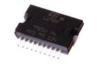

Contents
========

* [ICS298 > SMD (Power SO-20) Dual H-Bridge (L298) 4 A](#ics298--smd-power-so-20-dual-h-bridge-l298-4-a)
	* [Datasheets](#datasheets)
	* [Labels](#labels)
	* [EDA](#eda)
	* [Images](#images)
	* [Tags](#tags)
  
![][im]
# ICS298 > SMD (Power SO-20) Dual H-Bridge (L298) 4 A

- ID: ICIC-PS20-X-KL298-A4
- Hex ID: ICS298
- Name: SMD (Power SO-20) Dual H-Bridge (L298) 4 A
- Description: SMD (Power SO-20) Dual H-Bridge (L298) 4 A
- Long Link: [http://oom.lt/ICIC-PS20-X-KL298-A4](http://oom.lt/ICIC-PS20-X-KL298-A4)
- Short Link: [http://oom.lt/ICS298](http://oom.lt/ICS298)

## Datasheets

- Datasheet: [datasheet.pdf](datasheet.pdf)

## Labels
  
  

|label-front|label-inventory|label-spec|
| :---: | :---: | :---: |
||||

## EDA

### Symbols

## Images
  
  

|image|image_RE|image_BOTTOM|label-front|label-inventory|label-spec|
| :---: | :---: | :---: | :---: | :---: | :---: |
|||||||

## Tags

- oompID: ICIC-PS20-X-KL298-A4
- name: SMD (Power SO-20) Dual H-Bridge (L298) 4 A
- hexID: ICS298
- oompSort: 
- oompClass: Surface Mount
- oompClassCode: SMDS
- oompType: ICIC
- oompSize: PS20
- oompColor: X
- oompDesc: KL298
- oompIndex: A4
- oompVersion: 40
- ooDesignator: U1

[im]: image_450.jpg
