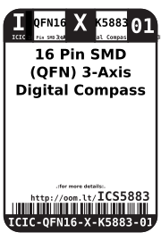
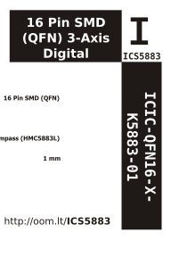

Contents
========

* [ICIC-QFN16-X-K5883-01>16 Pin SMD (QFN) 3-Axis Digital Compass (HMC5883L)](#icic-qfn16-x-k5883-0116-pin-smd-qfn-3-axis-digital-compass-hmc5883l)
	* [Datasheets](#datasheets)
	* [Labels](#labels)
	* [EDA](#eda)
		* [Symbols](#symbols)
	* [Tags](#tags)

# ICIC-QFN16-X-K5883-01>16 Pin SMD (QFN) 3-Axis Digital Compass (HMC5883L)

- ID: ICIC-QFN16-X-K5883-01
- Name: ICIC-QFN16-X-K5883-01

## Datasheets

- Datasheet: [datasheet.pdf](datasheet.pdf)

## Labels
  
  

|Front|Inventory|Specifications|
| :---: | :---: | :---: |
||||

## EDA

### Symbols

## Tags

- index: 12600
- oompID: ICIC-QFN16-X-K5883-01
- name: 16 Pin SMD (QFN) 3-Axis Digital Compass (HMC5883L)
- hexID: ICS5883
- oompSort: ICICQFN16K5883
- oompType: ICIC
- oompSize: QFN16
- oompColor: X
- oompDesc: K5883
- oompIndex: 01
- oompVersion: 98
- ooNumPins: 16
- ooDesignator: U1
