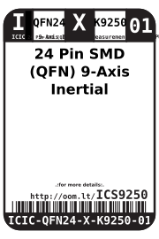
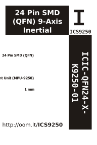

Contents
========

* [ICIC-QFN24-X-K9250-01>24 Pin SMD (QFN) 9-Axis Inertial Measurement Unit (MPU-9250)](#icic-qfn24-x-k9250-0124-pin-smd-qfn-9-axis-inertial-measurement-unit-mpu-9250)
	* [Datasheets](#datasheets)
	* [Labels](#labels)
	* [EDA](#eda)
		* [Symbols](#symbols)
	* [Tags](#tags)

# ICIC-QFN24-X-K9250-01>24 Pin SMD (QFN) 9-Axis Inertial Measurement Unit (MPU-9250)

- ID: ICIC-QFN24-X-K9250-01
- Name: ICIC-QFN24-X-K9250-01

## Datasheets

- Datasheet: [datasheet.pdf](datasheet.pdf)

## Labels
  
  

|label-front|label-inventory|label-spec|
| :---: | :---: | :---: |
||||

## EDA

### Symbols

## Tags

- oompID: ICIC-QFN24-X-K9250-01
- name: 24 Pin SMD (QFN) 9-Axis Inertial Measurement Unit (MPU-9250)
- hexID: ICS9250
- oompSort: ICICQFN24K9250
- oompType: ICIC
- oompSize: QFN24
- oompColor: X
- oompDesc: K9250
- oompIndex: 01
- oompVersion: 98
- ooNumPins: 24
- ooDesignator: U1
