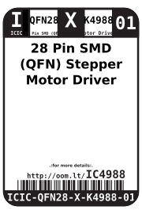
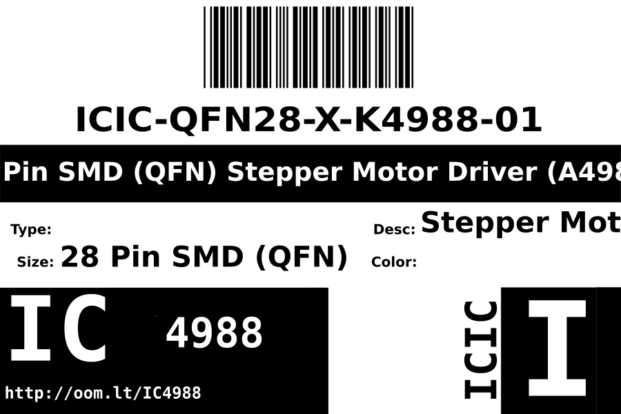

Contents
========

* [ICIC-QFN28-X-K4988-01>28 Pin SMD (QFN) Stepper Motor Driver (A4988)](#icic-qfn28-x-k4988-0128-pin-smd-qfn-stepper-motor-driver-a4988)
	* [Datasheets](#datasheets)
	* [Labels](#labels)
	* [EDA](#eda)
		* [Symbols](#symbols)
	* [Tags](#tags)

# ICIC-QFN28-X-K4988-01>28 Pin SMD (QFN) Stepper Motor Driver (A4988)

- ID: ICIC-QFN28-X-K4988-01
- Name: ICIC-QFN28-X-K4988-01

## Datasheets

- Datasheet: [datasheet.pdf](datasheet.pdf)

## Labels
  
  

|label-front|label-inventory|label-spec|
| :---: | :---: | :---: |
||||

## EDA

### Symbols

## Tags

- oompID: ICIC-QFN28-X-K4988-01
- name: 28 Pin SMD (QFN) Stepper Motor Driver (A4988)
- hexID: IC4988
- oompSort: 
- oompType: ICIC
- oompSize: QFN28
- oompColor: X
- oompDesc: K4988
- oompIndex: 01
- oompVersion: 98
- ooNumPins: 28
- ooPin1: OUT2B
- ooPin2: ENABLE
- ooPin3: GND
- ooPin4: CP1
- ooPin5: CP2
- ooPin6: VCP
- ooPin7: NC
- ooPin8: VREG
- ooPin9: MS1
- ooPin10: MS2
- ooPin11: MS3
- ooPin12: RESET
- ooPin13: ROSC
- ooPin14: SLEEP
- ooPin15: VDD
- ooPin16: STEP
- ooPin17: REF
- ooPin18: GND
- ooPin19: DIR
- ooPin20: NC
- ooPin21: OUT1B
- ooPin22: VBB1
- ooPin23: SENSE1
- ooPin24: OUT1A
- ooPin25: NC
- ooPin26: OUT2A
- ooPin27: SENSE2
- ooPin28: VBB2
- ooPackageMarking: A4988
- oompBbls: template;ICIC-QFN28-X-XXXX-01-bbls
- oompDiag: template;ICIC-QFN28-X-XXXX-01-diag
- oompIden: template;ICIC-QFN28-X-XXXX-01-iden
- oompSimp: template;ICIC-QFN28-X-XXXX-01-simp
- ooDesignator: U1
