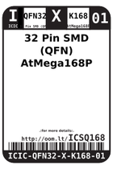
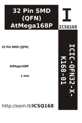

Contents
========

* [ICSQ168 > 32 Pin SMD (QFN) AtMega168P](#icsq168--32-pin-smd-qfn-atmega168p)
	* [Datasheets](#datasheets)
	* [Labels](#labels)
	* [EDA](#eda)
	* [Images](#images)
	* [Tags](#tags)

# ICSQ168 > 32 Pin SMD (QFN) AtMega168P

- ID: ICIC-QFN32-X-K168-01
- Hex ID: ICSQ168
- Name: 32 Pin SMD (QFN) AtMega168P
- Description: 32 Pin SMD (QFN) AtMega168P
- Long Link: [http://oom.lt/ICIC-QFN32-X-K168-01](http://oom.lt/ICIC-QFN32-X-K168-01)
- Short Link: [http://oom.lt/ICSQ168](http://oom.lt/ICSQ168)

## Datasheets

- Datasheet: [datasheet.pdf](datasheet.pdf)

## Labels
  
  

|label-front|label-inventory|label-spec|
| :---: | :---: | :---: |
||||

## EDA

### Symbols

## Images
  
  

|label-front|label-inventory|label-spec|
| :---: | :---: | :---: |
||||

## Tags

- oompID: ICIC-QFN32-X-K168-01
- name: 32 Pin SMD (QFN) AtMega168P
- hexID: ICSQ168
- oompSort: ICICQFN32K168
- oompType: ICIC
- oompSize: QFN32
- oompColor: X
- oompDesc: K168
- oompIndex: 01
- oompVersion: 98
- ooNumPins: 32
- ooDesignator: U
