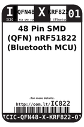
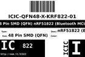
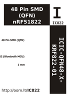

Contents
========

* [IC822 > 48 Pin SMD (QFN) nRF51822 (Bluetooth MCU)](#ic822--48-pin-smd-qfn-nrf51822-bluetooth-mcu)
	* [Images](#images)
	* [Datasheets](#datasheets)
	* [Labels](#labels)
	* [EDA](#eda)
	* [Tags](#tags)

# IC822 > 48 Pin SMD (QFN) nRF51822 (Bluetooth MCU)

- ID: ICIC-QFN48-X-KRF822-01
- Hex ID: IC822
- Name: 48 Pin SMD (QFN) nRF51822 (Bluetooth MCU)
- Description: 48 Pin SMD (QFN) nRF51822 (Bluetooth MCU)

## Images
  
  

|label-front|label-inventory|label-spec|
| :---: | :---: | :---: |
||||

## Datasheets

- Datasheet: [datasheet.pdf](datasheet.pdf)

## Labels
  
  

|label-front|label-inventory|label-spec|
| :---: | :---: | :---: |
||||

## EDA

### Symbols

## Tags

- oompID: ICIC-QFN48-X-KRF822-01
- name: 48 Pin SMD (QFN) nRF51822 (Bluetooth MCU)
- hexID: IC822
- oompSort: ICICQFN48KRF822
- oompType: ICIC
- oompSize: QFN48
- oompColor: X
- oompDesc: KRF822
- oompIndex: 01
- oompVersion: 98
- ooDesignator: U1
