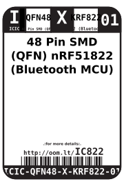
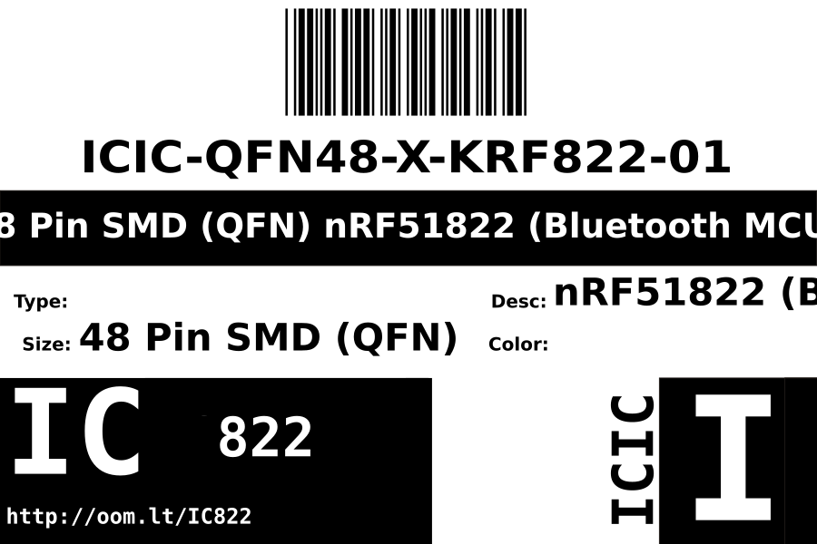

Contents
========

* [ICIC-QFN48-X-KRF822-01>48 Pin SMD (QFN) nRF51822 (Bluetooth MCU)](#icic-qfn48-x-krf822-0148-pin-smd-qfn-nrf51822-bluetooth-mcu)
	* [Datasheets](#datasheets)
	* [Labels](#labels)
	* [EDA](#eda)
		* [Symbols](#symbols)
	* [Tags](#tags)

# ICIC-QFN48-X-KRF822-01>48 Pin SMD (QFN) nRF51822 (Bluetooth MCU)

- ID: ICIC-QFN48-X-KRF822-01
- Name: ICIC-QFN48-X-KRF822-01

## Datasheets

- Datasheet: [datasheet.pdf](datasheet.pdf)

## Labels
  
  

|Front|Inventory|Specifications|
| :---: | :---: | :---: |
||||

## EDA

### Symbols

## Tags

- index: 305
- oompID: ICIC-QFN48-X-KRF822-01
- name: 48 Pin SMD (QFN) nRF51822 (Bluetooth MCU)
- hexID: IC822
- oompSort: ICICQFN48KRF822
- oompType: ICIC
- oompSize: QFN48
- oompColor: X
- oompDesc: KRF822
- oompIndex: 01
- oompVersion: 98
- ooDesignator: U1
