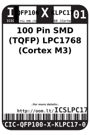

Contents
========

* [ICIC-QFP100-X-KLPC17-01>100 Pin SMD (TQFP) LPC1768 (Cortex M3)](#icic-qfp100-x-klpc17-01100-pin-smd-tqfp-lpc1768-cortex-m3)
	* [Datasheets](#datasheets)
	* [Labels](#labels)
	* [EDA](#eda)
		* [Symbols](#symbols)
	* [Tags](#tags)

# ICIC-QFP100-X-KLPC17-01>100 Pin SMD (TQFP) LPC1768 (Cortex M3)

- ID: ICIC-QFP100-X-KLPC17-01
- Name: ICIC-QFP100-X-KLPC17-01

## Datasheets

- Datasheet: [datasheet.pdf](datasheet.pdf)

## Labels
  
  

|label-front|label-inventory|label-spec|
| :---: | :---: | :---: |
||||

## EDA

### Symbols

## Tags

- oompID: ICIC-QFP100-X-KLPC17-01
- name: 100 Pin SMD (TQFP) LPC1768 (Cortex M3)
- hexID: ICSLPC17
- oompSort: 
- oompClass: Surface Mount
- oompClassCode: SMDS
- oompType: ICIC
- oompSize: QFP100
- oompColor: X
- oompDesc: KLPC17
- oompIndex: 01
- oompVersion: 40
- ooDesignator: U1
