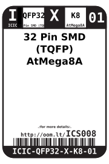

Contents
========

* [ICIC-QFP32-X-K8-01>32 Pin SMD (TQFP) AtMega8A](#icic-qfp32-x-k8-0132-pin-smd-tqfp-atmega8a)
	* [Images](#images)
	* [Datasheets](#datasheets)
	* [Labels](#labels)
	* [EDA](#eda)
		* [Symbols](#symbols)
	* [Tags](#tags)
  
![][im]
# ICIC-QFP32-X-K8-01>32 Pin SMD (TQFP) AtMega8A

- ID: ICIC-QFP32-X-K8-01
- Name: ICIC-QFP32-X-K8-01

## Images
  
  

|image|image_RE|image_BOTTOM|
| :---: | :---: | :---: |
||||

## Datasheets

- Datasheet: [datasheet.pdf](datasheet.pdf)

## Labels
  
  

|label-front|label-inventory|label-spec|
| :---: | :---: | :---: |
||||

## EDA

### Symbols

## Tags

- oompID: ICIC-QFP32-X-K8-01
- name: 32 Pin SMD (TQFP) AtMega8A
- hexID: ICS008
- oompSort: 
- oompClass: Surface Mount
- oompClassCode: SMDS
- oompType: ICIC
- oompSize: QFP32
- oompColor: X
- oompDesc: K8
- oompIndex: 01
- oompVersion: 40
- ooDesignator: U1

[im]: image_600.jpg
