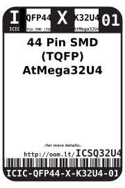
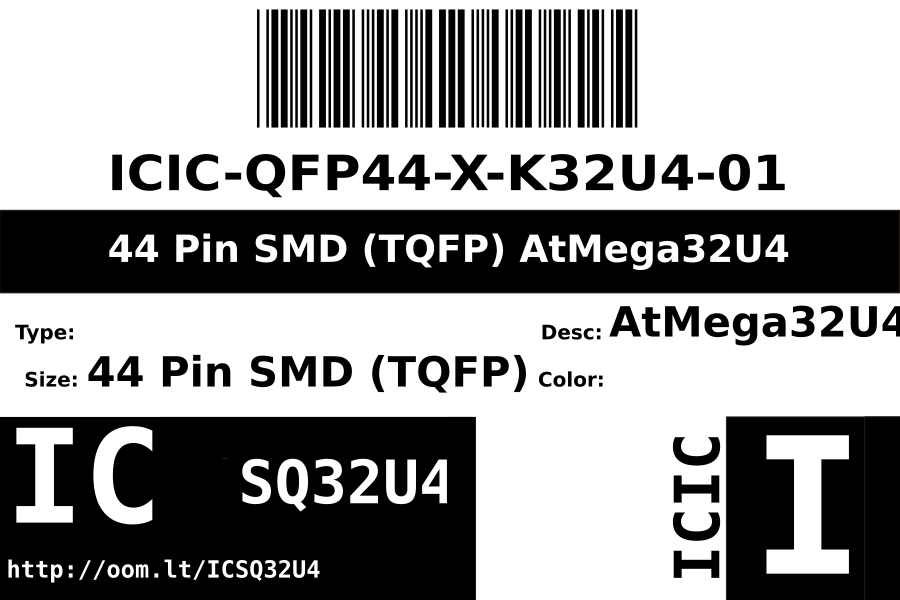
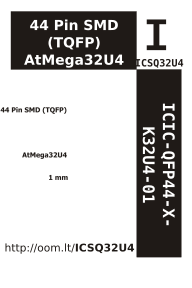

Contents
========

* [ICIC-QFP44-X-K32U4-01>44 Pin SMD (TQFP) AtMega32U4](#icic-qfp44-x-k32u4-0144-pin-smd-tqfp-atmega32u4)
	* [Images](#images)
	* [Datasheets](#datasheets)
	* [Labels](#labels)
	* [EDA](#eda)
		* [Symbols](#symbols)
	* [Tags](#tags)
  
![][im]
# ICIC-QFP44-X-K32U4-01>44 Pin SMD (TQFP) AtMega32U4

- ID: ICIC-QFP44-X-K32U4-01
- Name: ICIC-QFP44-X-K32U4-01

## Images
  
  

|Main|Reference|Bottom|
| :---: | :---: | :---: |
||||

## Datasheets

- Datasheet: [datasheet.pdf](datasheet.pdf)

## Labels
  
  

|Front|Inventory|Specifications|
| :---: | :---: | :---: |
||||

## EDA

### Symbols

## Tags

- hexID: ICSQ32U4
- oompSort: 
- oompClass: Surface Mount
- oompClassCode: SMDS
- oompType: ICIC
- oompSize: QFP44
- oompColor: X
- oompDesc: K32U4
- oompIndex: 01
- oompVersion: 40
- ooDesignator: U1

[im]: image_600.jpg
