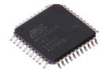

Contents
========

* [ICSQ32U4 > 44 Pin SMD (TQFP) AtMega32U4](#icsq32u4--44-pin-smd-tqfp-atmega32u4)
	* [Datasheets](#datasheets)
	* [Labels](#labels)
	* [EDA](#eda)
	* [Images](#images)
	* [Tags](#tags)
  
![][im]
# ICSQ32U4 > 44 Pin SMD (TQFP) AtMega32U4

- ID: ICIC-QFP44-X-K32U4-01
- Hex ID: ICSQ32U4
- Name: 44 Pin SMD (TQFP) AtMega32U4
- Description: 44 Pin SMD (TQFP) AtMega32U4
- Long Link: [http://oom.lt/ICIC-QFP44-X-K32U4-01](http://oom.lt/ICIC-QFP44-X-K32U4-01)
- Long Link: [http://oom.lt/ICSQ32U4](http://oom.lt/ICSQ32U4)

## Datasheets

- Datasheet: [datasheet.pdf](datasheet.pdf)

## Labels
  
  

|label-front|label-inventory|label-spec|
| :---: | :---: | :---: |
||||

## EDA

### Symbols

## Images
  
  

|image|image_RE|image_BOTTOM|label-front|label-inventory|label-spec|
| :---: | :---: | :---: | :---: | :---: | :---: |
|||||||

## Tags

- oompID: ICIC-QFP44-X-K32U4-01
- name: 44 Pin SMD (TQFP) AtMega32U4
- hexID: ICSQ32U4
- oompSort: 
- oompClass: Surface Mount
- oompClassCode: SMDS
- oompType: ICIC
- oompSize: QFP44
- oompColor: X
- oompDesc: K32U4
- oompIndex: 01
- oompVersion: 40
- ooDesignator: U1

[im]: image_450.jpg
