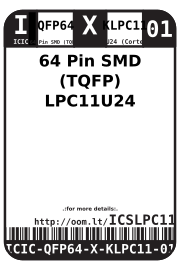
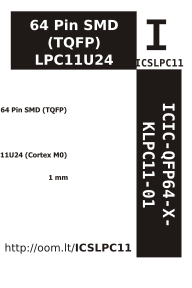

Contents
========

* [ICIC-QFP64-X-KLPC11-01>64 Pin SMD (TQFP) LPC11U24 (Cortex M0)](#icic-qfp64-x-klpc11-0164-pin-smd-tqfp-lpc11u24-cortex-m0)
	* [Datasheets](#datasheets)
	* [Labels](#labels)
	* [EDA](#eda)
		* [Symbols](#symbols)
	* [Tags](#tags)

# ICIC-QFP64-X-KLPC11-01>64 Pin SMD (TQFP) LPC11U24 (Cortex M0)

- ID: ICIC-QFP64-X-KLPC11-01
- Name: ICIC-QFP64-X-KLPC11-01

## Datasheets

- Datasheet: [datasheet.pdf](datasheet.pdf)

## Labels
  
  

|Front|Inventory|Specifications|
| :---: | :---: | :---: |
||||

## EDA

### Symbols

## Tags

- index: 309
- oompID: ICIC-QFP64-X-KLPC11-01
- name: 64 Pin SMD (TQFP) LPC11U24 (Cortex M0)
- hexID: ICSLPC11
- oompSort: 
- oompClass: Surface Mount
- oompClassCode: SMDS
- oompType: ICIC
- oompSize: QFP64
- oompColor: X
- oompDesc: KLPC11
- oompIndex: 01
- oompVersion: 40
- ooDesignator: U1
