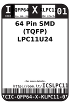
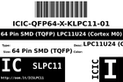
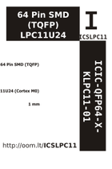

Contents
========

* [ICSLPC11 > 64 Pin SMD (TQFP) LPC11U24 (Cortex M0)](#icslpc11--64-pin-smd-tqfp-lpc11u24-cortex-m0)
	* [Datasheets](#datasheets)
	* [Labels](#labels)
	* [EDA](#eda)
	* [Images](#images)
	* [Tags](#tags)

# ICSLPC11 > 64 Pin SMD (TQFP) LPC11U24 (Cortex M0)

- ID: ICIC-QFP64-X-KLPC11-01
- Hex ID: ICSLPC11
- Name: 64 Pin SMD (TQFP) LPC11U24 (Cortex M0)
- Description: 64 Pin SMD (TQFP) LPC11U24 (Cortex M0)
- Long Link: [http://oom.lt/ICIC-QFP64-X-KLPC11-01](http://oom.lt/ICIC-QFP64-X-KLPC11-01)
- Short Link: [http://oom.lt/ICSLPC11](http://oom.lt/ICSLPC11)

## Datasheets

- Datasheet: [datasheet.pdf](datasheet.pdf)

## Labels
  
  

|label-front|label-inventory|label-spec|
| :---: | :---: | :---: |
||||

## EDA

### Symbols

## Images
  
  

|label-front|label-inventory|label-spec|
| :---: | :---: | :---: |
||||

## Tags

- oompID: ICIC-QFP64-X-KLPC11-01
- name: 64 Pin SMD (TQFP) LPC11U24 (Cortex M0)
- hexID: ICSLPC11
- oompSort: 
- oompClass: Surface Mount
- oompClassCode: SMDS
- oompType: ICIC
- oompSize: QFP64
- oompColor: X
- oompDesc: KLPC11
- oompIndex: 01
- oompVersion: 40
- ooDesignator: U1
