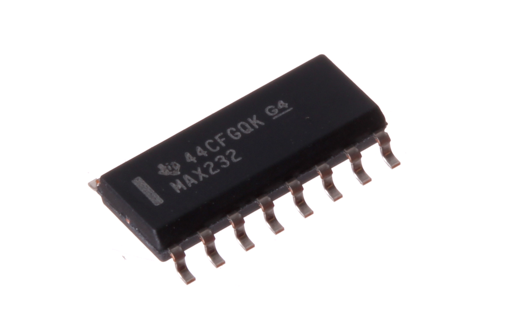
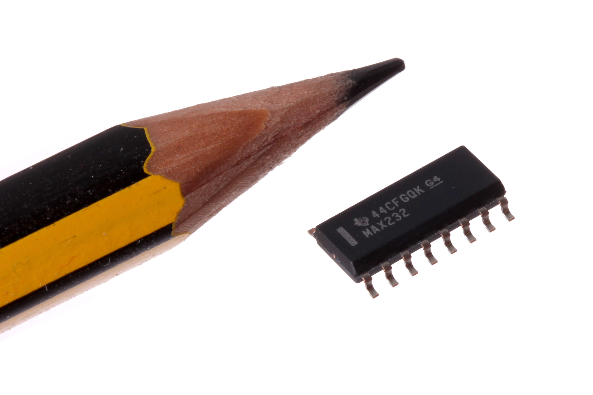
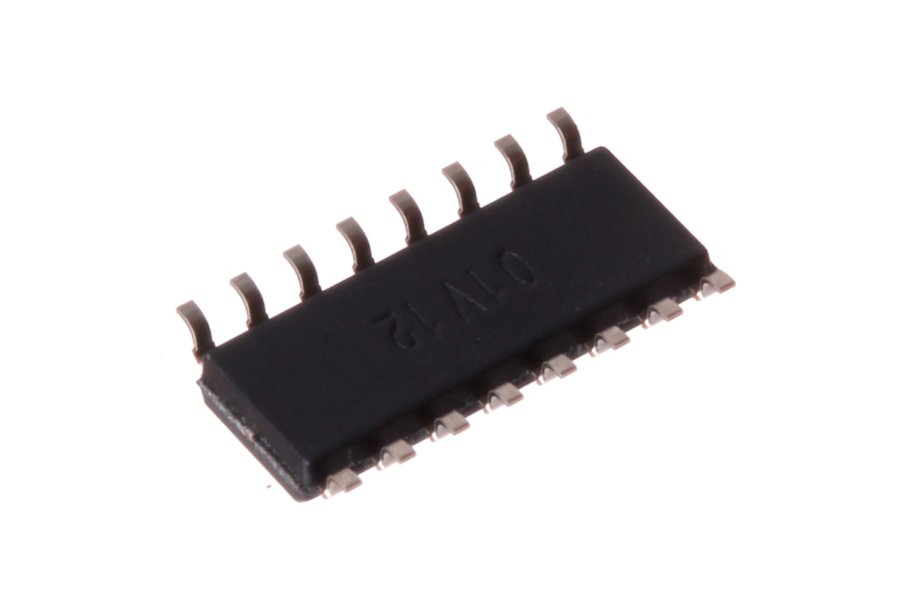

Contents
========

* [ICIC-SC16-X-KM232-01>16 Pin SMD (SOIC) RS232 to TTL Converter (MAX232)](#icic-sc16-x-km232-0116-pin-smd-soic-rs232-to-ttl-converter-max232)
	* [Images](#images)
	* [Datasheets](#datasheets)
	* [EDA](#eda)
		* [Symbols](#symbols)
	* [Tags](#tags)
  
![][im]
# ICIC-SC16-X-KM232-01>16 Pin SMD (SOIC) RS232 to TTL Converter (MAX232)

- ID: ICIC-SC16-X-KM232-01
- Name: ICIC-SC16-X-KM232-01

## Images
  
  

|Main|Reference|Bottom|
| :---: | :---: | :---: |
||||

## Datasheets

- Datasheet: [datasheet.pdf](datasheet.pdf)

## EDA

### Symbols

## Tags

- index: 310
- oompID: ICIC-SC16-X-KM232-01
- name: 16 Pin SMD (SOIC) RS232 to TTL Converter (MAX232)
- hexID: ICSM232
- oompSort: 
- oompClass: Surface Mount
- oompClassCode: SMDS
- oompType: ICIC
- oompSize: SC16
- oompColor: X
- oompDesc: KM232
- oompIndex: 01
- oompVersion: 40
- ooDesignator: U1

[im]: image_600.jpg
