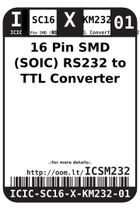
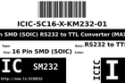
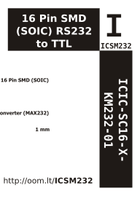
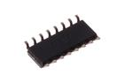

Contents
========

* [ICSM232 > 16 Pin SMD (SOIC) RS232 to TTL Converter (MAX232)](#icsm232--16-pin-smd-soic-rs232-to-ttl-converter-max232)
	* [Datasheets](#datasheets)
	* [Labels](#labels)
	* [EDA](#eda)
	* [Images](#images)
	* [Tags](#tags)
  
![][im]
# ICSM232 > 16 Pin SMD (SOIC) RS232 to TTL Converter (MAX232)

- ID: ICIC-SC16-X-KM232-01
- Hex ID: ICSM232
- Name: 16 Pin SMD (SOIC) RS232 to TTL Converter (MAX232)
- Description: 16 Pin SMD (SOIC) RS232 to TTL Converter (MAX232)
- Long Link: [http://oom.lt/ICIC-SC16-X-KM232-01](http://oom.lt/ICIC-SC16-X-KM232-01)
- Short Link: [http://oom.lt/ICSM232](http://oom.lt/ICSM232)

## Datasheets

- Datasheet: [datasheet.pdf](datasheet.pdf)

## Labels
  
  

|label-front|label-inventory|label-spec|
| :---: | :---: | :---: |
||||

## EDA

### Symbols

## Images
  
  

|image|image_RE|image_BOTTOM|label-front|label-inventory|label-spec|
| :---: | :---: | :---: | :---: | :---: | :---: |
|||||||

## Tags

- oompID: ICIC-SC16-X-KM232-01
- name: 16 Pin SMD (SOIC) RS232 to TTL Converter (MAX232)
- hexID: ICSM232
- oompSort: 
- oompClass: Surface Mount
- oompClassCode: SMDS
- oompType: ICIC
- oompSize: SC16
- oompColor: X
- oompDesc: KM232
- oompIndex: 01
- oompVersion: 40
- ooDesignator: U1

[im]: image_450.jpg
