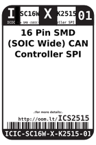
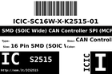

Contents
========

* [ICS2515 > 16 Pin SMD (SOIC Wide) CAN Controller SPI (MCP2515)](#ics2515--16-pin-smd-soic-wide-can-controller-spi-mcp2515)
	* [Images](#images)
	* [Datasheets](#datasheets)
	* [Labels](#labels)
	* [EDA](#eda)
	* [Tags](#tags)
  
![][im]
# ICS2515 > 16 Pin SMD (SOIC Wide) CAN Controller SPI (MCP2515)

- ID: ICIC-SC16W-X-K2515-01
- Hex ID: ICS2515
- Name: 16 Pin SMD (SOIC Wide) CAN Controller SPI (MCP2515)
- Description: 16 Pin SMD (SOIC Wide) CAN Controller SPI (MCP2515)

## Images
  
  

|image|image_RE|image_BOTTOM|label-front|label-inventory|label-spec|
| :---: | :---: | :---: | :---: | :---: | :---: |
|||||||

## Datasheets

- Datasheet: [datasheet.pdf](datasheet.pdf)

## Labels
  
  

|label-front|label-inventory|label-spec|
| :---: | :---: | :---: |
||||

## EDA

### Symbols

## Tags

- oompID: ICIC-SC16W-X-K2515-01
- name: 16 Pin SMD (SOIC Wide) CAN Controller SPI (MCP2515)
- hexID: ICS2515
- oompSort: 
- oompClass: Surface Mount
- oompClassCode: SMDS
- oompType: ICIC
- oompSize: SC16W
- oompColor: X
- oompDesc: K2515
- oompIndex: 01
- oompVersion: 40
- ooDesignator: U1

[im]: image_450.jpg
