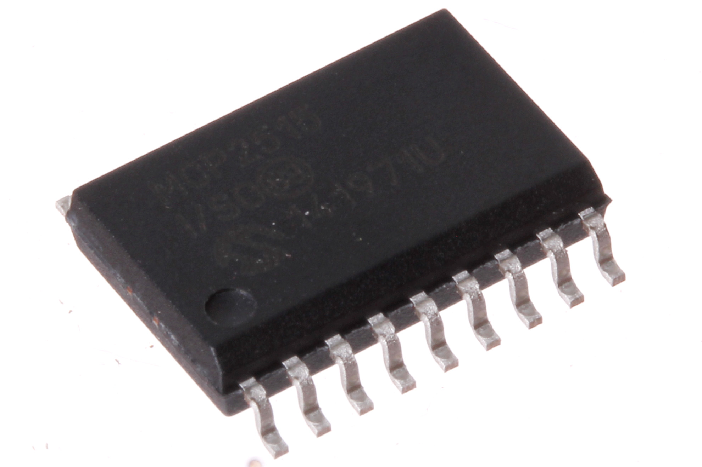
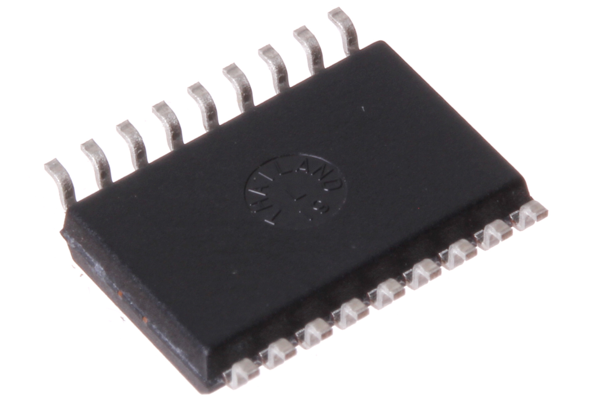
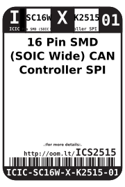
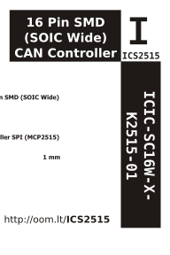

Contents
========

* [ICIC-SC16W-X-K2515-01>16 Pin SMD (SOIC Wide) CAN Controller SPI (MCP2515)](#icic-sc16w-x-k2515-0116-pin-smd-soic-wide-can-controller-spi-mcp2515)
	* [Images](#images)
	* [Datasheets](#datasheets)
	* [Labels](#labels)
	* [EDA](#eda)
		* [Symbols](#symbols)
	* [Tags](#tags)
  
![][im]
# ICIC-SC16W-X-K2515-01>16 Pin SMD (SOIC Wide) CAN Controller SPI (MCP2515)

- ID: ICIC-SC16W-X-K2515-01
- Name: ICIC-SC16W-X-K2515-01

## Images
  
  

|Main|Reference|Bottom|
| :---: | :---: | :---: |
||||

## Datasheets

- Datasheet: [datasheet.pdf](datasheet.pdf)

## Labels
  
  

|Front|Inventory|Specifications|
| :---: | :---: | :---: |
||||

## EDA

### Symbols

## Tags

- oompID: ICIC-SC16W-X-K2515-01
- name: 16 Pin SMD (SOIC Wide) CAN Controller SPI (MCP2515)
- hexID: ICS2515
- oompSort: 
- oompClass: Surface Mount
- oompClassCode: SMDS
- oompType: ICIC
- oompSize: SC16W
- oompColor: X
- oompDesc: K2515
- oompIndex: 01
- oompVersion: 40
- ooDesignator: U1

[im]: image_600.jpg
