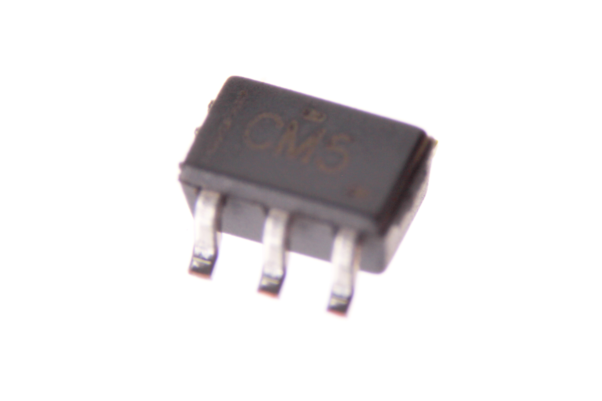
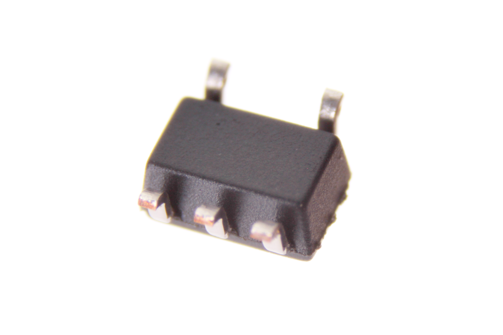

Contents
========

* [ICIC-SC75-X-K125LS-01>5 Pin SMD (SC70) Single Buffer (74LVC1G125)](#icic-sc75-x-k125ls-015-pin-smd-sc70-single-buffer-74lvc1g125)
	* [Images](#images)
	* [Datasheets](#datasheets)
	* [EDA](#eda)
		* [Symbols](#symbols)
	* [Tags](#tags)
  
![][im]
# ICIC-SC75-X-K125LS-01>5 Pin SMD (SC70) Single Buffer (74LVC1G125)

- ID: ICIC-SC75-X-K125LS-01
- Name: ICIC-SC75-X-K125LS-01

## Images
  
  

|Main|Bottom|
| :---: | :---: |
|||

## Datasheets

- Datasheet: [datasheet.pdf](datasheet.pdf)

## EDA

### Symbols

## Tags

- index: 312
- oompID: ICIC-SC75-X-K125LS-01
- name: 5 Pin SMD (SC70) Single Buffer (74LVC1G125)
- hexID: ICS125LS
- oompSort: 
- oompClass: Surface Mount
- oompClassCode: SMDS
- oompType: ICIC
- oompSize: SC75
- oompColor: X
- oompDesc: K125LS
- oompIndex: 01
- oompVersion: 40
- ooDesignator: U1

[im]: image_600.jpg
