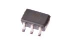

Contents
========

* [ICS125LS > 5 Pin SMD (SC70) Single Buffer (74LVC1G125)](#ics125ls--5-pin-smd-sc70-single-buffer-74lvc1g125)
	* [Images](#images)
	* [Datasheets](#datasheets)
	* [Labels](#labels)
	* [EDA](#eda)
	* [Tags](#tags)
  
![][im]
# ICS125LS > 5 Pin SMD (SC70) Single Buffer (74LVC1G125)

- ID: ICIC-SC75-X-K125LS-01
- Hex ID: ICS125LS
- Name: 5 Pin SMD (SC70) Single Buffer (74LVC1G125)
- Description: 5 Pin SMD (SC70) Single Buffer (74LVC1G125)

## Images
  
  

|image|image_BOTTOM|label-front|label-inventory|label-spec|
| :---: | :---: | :---: | :---: | :---: |
||||||

## Datasheets

- Datasheet: [datasheet.pdf](datasheet.pdf)

## Labels
  
  

|label-front|label-inventory|label-spec|
| :---: | :---: | :---: |
||||

## EDA

### Symbols

## Tags

- oompID: ICIC-SC75-X-K125LS-01
- name: 5 Pin SMD (SC70) Single Buffer (74LVC1G125)
- hexID: ICS125LS
- oompSort: 
- oompClass: Surface Mount
- oompClassCode: SMDS
- oompType: ICIC
- oompSize: SC75
- oompColor: X
- oompDesc: K125LS
- oompIndex: 01
- oompVersion: 40
- ooDesignator: U1

[im]: image_450.jpg
