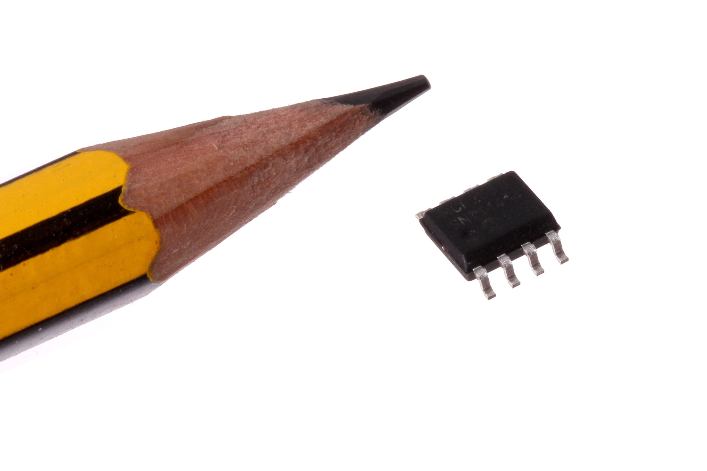
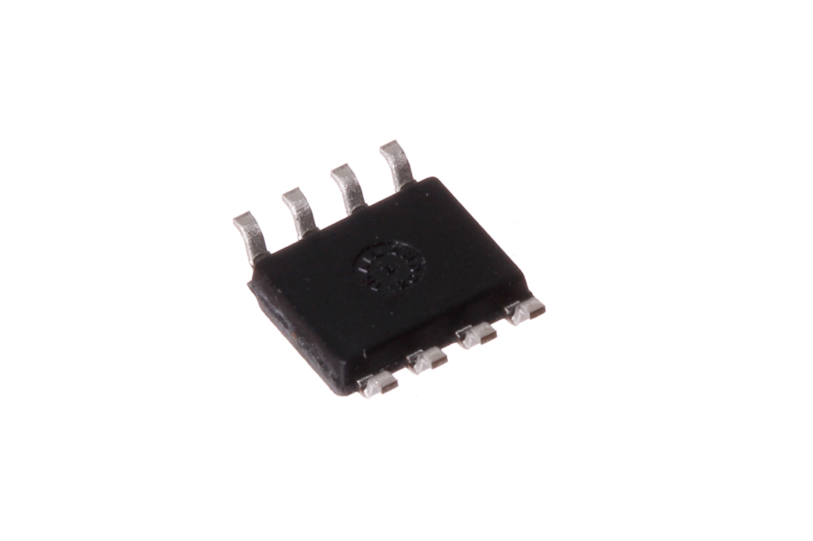

Contents
========

* [ICIC-SC8-X-K2551-01>8 Pin SMD (SOIC) CAN Tranceiver (MCP2521)](#icic-sc8-x-k2551-018-pin-smd-soic-can-tranceiver-mcp2521)
	* [Images](#images)
	* [Datasheets](#datasheets)
	* [EDA](#eda)
		* [Footprints](#footprints)
		* [Symbols](#symbols)
	* [Tags](#tags)

# ICIC-SC8-X-K2551-01>8 Pin SMD (SOIC) CAN Tranceiver (MCP2521)

- ID: ICIC-SC8-X-K2551-01
- Name: ICIC-SC8-X-K2551-01

## Images
  
  

|Main|Reference|Bottom|
| :---: | :---: | :---: |
||||

## Datasheets

- Datasheet: [datasheet.pdf](datasheet.pdf)

## EDA

### Footprints
  

|||||
| :---: | :---: | :---: | :---: |

### Symbols

## Tags

- index: 313
- oompID: ICIC-SC8-X-K2551-01
- name: 8 Pin SMD (SOIC) CAN Tranceiver (MCP2521)
- hexID: ICS2551
- oompSort: 
- oompClass: Surface Mount
- oompClassCode: SMDS
- oompType: ICIC
- oompSize: SC8
- oompColor: X
- oompDesc: K2551
- oompIndex: 01
- oompVersion: 40
- ooDesignator: U1
