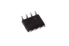

Contents
========

* [ICIC-SC8-X-KDS1307-01>SMD (SOIC-8) Real Time Clock (DS1307)](#icic-sc8-x-kds1307-01smd-soic-8-real-time-clock-ds1307)
	* [Images](#images)
	* [Datasheets](#datasheets)
	* [Labels](#labels)
	* [EDA](#eda)
		* [Symbols](#symbols)
	* [Tags](#tags)
  
![][im]
# ICIC-SC8-X-KDS1307-01>SMD (SOIC-8) Real Time Clock (DS1307)

- ID: ICIC-SC8-X-KDS1307-01
- Name: ICIC-SC8-X-KDS1307-01

## Images
  
  

|image|image_RE|image_BOTTOM|
| :---: | :---: | :---: |
||||

## Datasheets

- Datasheet: [datasheet.pdf](datasheet.pdf)

## Labels
  
  

|label-front|label-inventory|label-spec|
| :---: | :---: | :---: |
||||

## EDA

### Symbols

## Tags

- oompID: ICIC-SC8-X-KDS1307-01
- name: SMD (SOIC-8) Real Time Clock (DS1307)
- hexID: ICS1307
- oompSort: 
- oompClass: Surface Mount
- oompClassCode: SMDS
- oompType: ICIC
- oompSize: SC8
- oompColor: X
- oompDesc: KDS1307
- oompIndex: 01
- oompVersion: 40
- ooDesignator: U1

[im]: image_600.jpg
