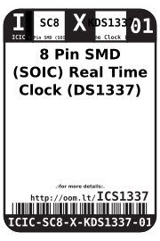
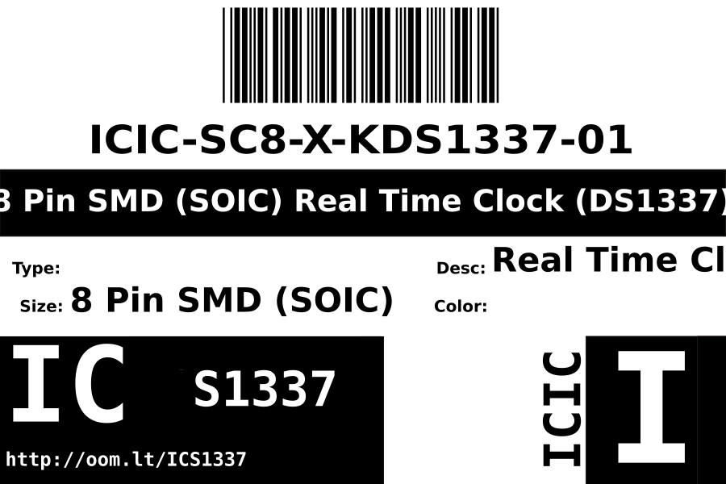
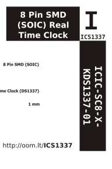

Contents
========

* [ICIC-SC8-X-KDS1337-01>8 Pin SMD (SOIC) Real Time Clock (DS1337)](#icic-sc8-x-kds1337-018-pin-smd-soic-real-time-clock-ds1337)
	* [Datasheets](#datasheets)
	* [Labels](#labels)
	* [EDA](#eda)
		* [Symbols](#symbols)
	* [Tags](#tags)

# ICIC-SC8-X-KDS1337-01>8 Pin SMD (SOIC) Real Time Clock (DS1337)

- ID: ICIC-SC8-X-KDS1337-01
- Name: ICIC-SC8-X-KDS1337-01

## Datasheets

- Datasheet: [datasheet.pdf](datasheet.pdf)

## Labels
  
  

|Front|Inventory|Specifications|
| :---: | :---: | :---: |
||||

## EDA

### Symbols

## Tags

- hexID: ICS1337
- oompSort: 
- oompClass: Surface Mount
- oompClassCode: SMDS
- oompType: ICIC
- oompSize: SC8
- oompColor: X
- oompDesc: KDS1337
- oompIndex: 01
- oompVersion: 40
- ooDesignator: U1
