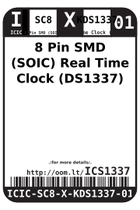
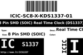
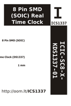

Contents
========

* [ICS1337 > 8 Pin SMD (SOIC) Real Time Clock (DS1337)](#ics1337--8-pin-smd-soic-real-time-clock-ds1337)
	* [Datasheets](#datasheets)
	* [Labels](#labels)
	* [EDA](#eda)
	* [Images](#images)
	* [Tags](#tags)

# ICS1337 > 8 Pin SMD (SOIC) Real Time Clock (DS1337)

- ID: ICIC-SC8-X-KDS1337-01
- Hex ID: ICS1337
- Name: 8 Pin SMD (SOIC) Real Time Clock (DS1337)
- Description: 8 Pin SMD (SOIC) Real Time Clock (DS1337)
- Long Link: [http://oom.lt/ICIC-SC8-X-KDS1337-01](http://oom.lt/ICIC-SC8-X-KDS1337-01)
- Long Link: [http://oom.lt/ICS1337](http://oom.lt/ICS1337)

## Datasheets

- Datasheet: [datasheet.pdf](datasheet.pdf)

## Labels
  
  

|label-front|label-inventory|label-spec|
| :---: | :---: | :---: |
||||

## EDA

### Symbols

## Images
  
  

|label-front|label-inventory|label-spec|
| :---: | :---: | :---: |
||||

## Tags

- oompID: ICIC-SC8-X-KDS1337-01
- name: 8 Pin SMD (SOIC) Real Time Clock (DS1337)
- hexID: ICS1337
- oompSort: 
- oompClass: Surface Mount
- oompClassCode: SMDS
- oompType: ICIC
- oompSize: SC8
- oompColor: X
- oompDesc: KDS1337
- oompIndex: 01
- oompVersion: 40
- ooDesignator: U1
