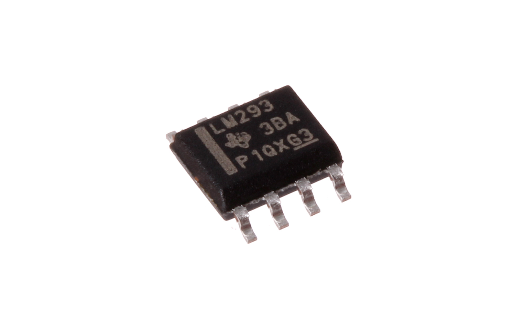
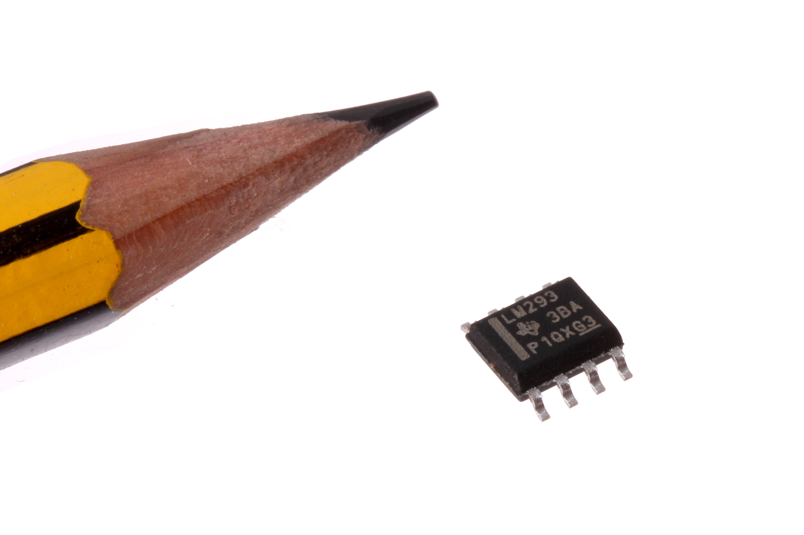
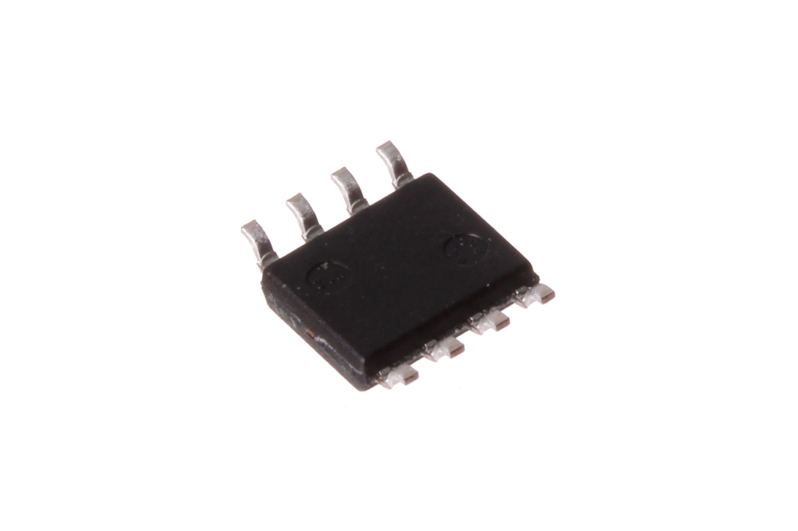

Contents
========

* [ICIC-SC8-X-KM293-01>8 Pin SMD (SOIC) Dual Differential Comparator (LM293)](#icic-sc8-x-km293-018-pin-smd-soic-dual-differential-comparator-lm293)
	* [Images](#images)
	* [Datasheets](#datasheets)
	* [EDA](#eda)
		* [Symbols](#symbols)
	* [Tags](#tags)
  
![][im]
# ICIC-SC8-X-KM293-01>8 Pin SMD (SOIC) Dual Differential Comparator (LM293)

- ID: ICIC-SC8-X-KM293-01
- Name: ICIC-SC8-X-KM293-01

## Images
  
  

|Main|Reference|Bottom|
| :---: | :---: | :---: |
||||

## Datasheets

- Datasheet: [datasheet.pdf](datasheet.pdf)

## EDA

### Symbols

## Tags

- index: 316
- oompID: ICIC-SC8-X-KM293-01
- name: 8 Pin SMD (SOIC) Dual Differential Comparator (LM293)
- hexID: ICSM293
- oompSort: 
- oompClass: Surface Mount
- oompClassCode: SMDS
- oompType: ICIC
- oompSize: SC8
- oompColor: X
- oompDesc: KM293
- oompIndex: 01
- oompVersion: 40
- ooDesignator: U1

[im]: image_600.jpg
