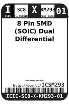
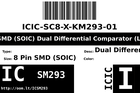
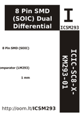
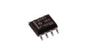
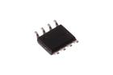

Contents
========

* [ICSM293 > 8 Pin SMD (SOIC) Dual Differential Comparator (LM293)](#icsm293--8-pin-smd-soic-dual-differential-comparator-lm293)
	* [Datasheets](#datasheets)
	* [Labels](#labels)
	* [EDA](#eda)
	* [Images](#images)
	* [Tags](#tags)
  
![][im]
# ICSM293 > 8 Pin SMD (SOIC) Dual Differential Comparator (LM293)

- ID: ICIC-SC8-X-KM293-01
- Hex ID: ICSM293
- Name: 8 Pin SMD (SOIC) Dual Differential Comparator (LM293)
- Description: 8 Pin SMD (SOIC) Dual Differential Comparator (LM293)
- Long Link: [http://oom.lt/ICIC-SC8-X-KM293-01](http://oom.lt/ICIC-SC8-X-KM293-01)
- Long Link: [http://oom.lt/ICSM293](http://oom.lt/ICSM293)

## Datasheets

- Datasheet: [datasheet.pdf](datasheet.pdf)

## Labels
  
  

|label-front|label-inventory|label-spec|
| :---: | :---: | :---: |
||||

## EDA

### Symbols

## Images
  
  

|image|image_RE|image_BOTTOM|label-front|label-inventory|label-spec|
| :---: | :---: | :---: | :---: | :---: | :---: |
|||||||

## Tags

- oompID: ICIC-SC8-X-KM293-01
- name: 8 Pin SMD (SOIC) Dual Differential Comparator (LM293)
- hexID: ICSM293
- oompSort: 
- oompClass: Surface Mount
- oompClassCode: SMDS
- oompType: ICIC
- oompSize: SC8
- oompColor: X
- oompDesc: KM293
- oompIndex: 01
- oompVersion: 40
- ooDesignator: U1

[im]: image_450.jpg
