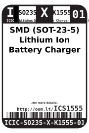
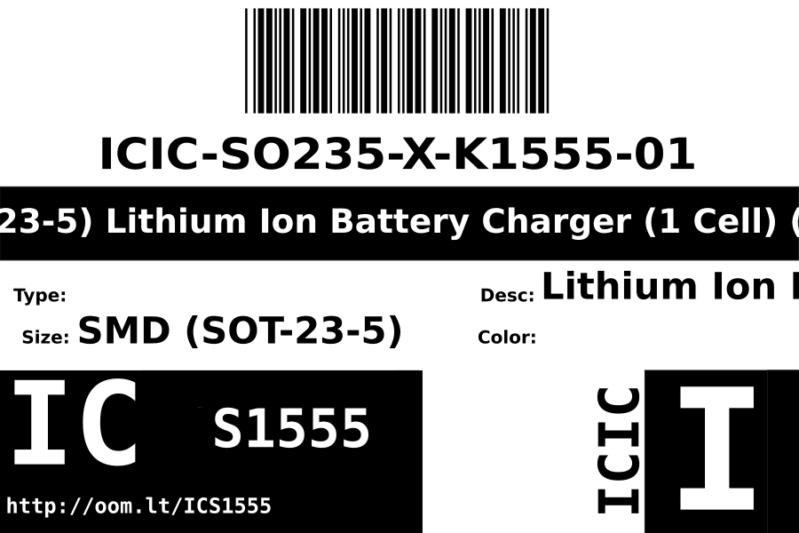
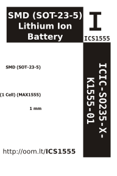

Contents
========

* [ICIC-SO235-X-K1555-01>SMD (SOT-23-5) Lithium Ion Battery Charger (1 Cell) (MAX1555)](#icic-so235-x-k1555-01smd-sot-23-5-lithium-ion-battery-charger-1-cell-max1555)
	* [Images](#images)
	* [Datasheets](#datasheets)
	* [Labels](#labels)
	* [EDA](#eda)
		* [Symbols](#symbols)
	* [Tags](#tags)
  
![][im]
# ICIC-SO235-X-K1555-01>SMD (SOT-23-5) Lithium Ion Battery Charger (1 Cell) (MAX1555)

- ID: ICIC-SO235-X-K1555-01
- Name: ICIC-SO235-X-K1555-01

## Images
  
  

|Main|Bottom|
| :---: | :---: |
|||

## Datasheets

- Datasheet: [datasheet.pdf](datasheet.pdf)

## Labels
  
  

|Front|Inventory|Specifications|
| :---: | :---: | :---: |
||||

## EDA

### Symbols

## Tags

- index: 12616
- oompID: ICIC-SO235-X-K1555-01
- name: SMD (SOT-23-5) Lithium Ion Battery Charger (1 Cell) (MAX1555)
- hexID: ICS1555
- oompSort: 
- oompClass: Surface Mount
- oompClassCode: SMDS
- oompType: ICIC
- oompSize: SO235
- oompColor: X
- oompDesc: K1555
- oompIndex: 01
- oompVersion: 40
- ooDesignator: U1

[im]: image_600.jpg
