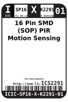
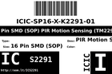

Contents
========

* [ICS2291 > 16 Pin SMD (SOP) PIR Motion Sensing (TM2291)](#ics2291--16-pin-smd-sop-pir-motion-sensing-tm2291)
	* [Images](#images)
	* [Datasheets](#datasheets)
	* [Labels](#labels)
	* [EDA](#eda)
	* [Tags](#tags)

# ICS2291 > 16 Pin SMD (SOP) PIR Motion Sensing (TM2291)

- ID: ICIC-SP16-X-K2291-01
- Hex ID: ICS2291
- Name: 16 Pin SMD (SOP) PIR Motion Sensing (TM2291)
- Description: 16 Pin SMD (SOP) PIR Motion Sensing (TM2291)

## Images
  
  

|label-front|label-inventory|label-spec|
| :---: | :---: | :---: |
||||

## Datasheets

- Datasheet: [datasheet.pdf](datasheet.pdf)

## Labels
  
  

|label-front|label-inventory|label-spec|
| :---: | :---: | :---: |
||||

## EDA

### Symbols

## Tags

- oompID: ICIC-SP16-X-K2291-01
- name: 16 Pin SMD (SOP) PIR Motion Sensing (TM2291)
- hexID: ICS2291
- oompSort: ICICSP16K2291
- oompType: ICIC
- oompSize: SP16
- oompColor: X
- oompDesc: K2291
- oompIndex: 01
- oompVersion: 98
- ooNumPins: 16
- ooDesignator: U1
